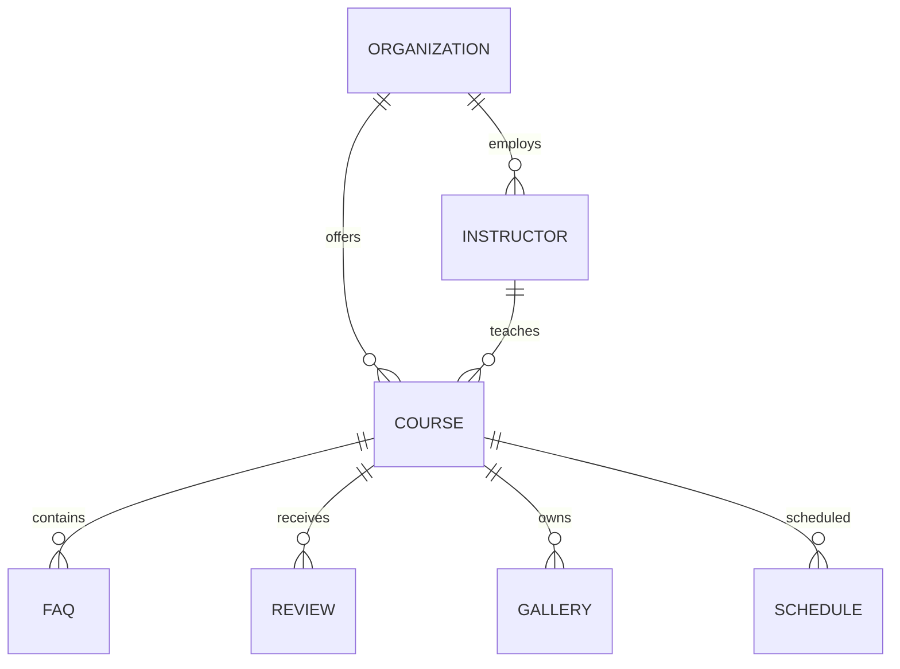

MASTER_ARCHITECTURE.md

Version 2.0 Enterprise

Part 1
1. Vision
1.1 Purpose

Fateh Music Academy is not designed merely as a marketing website.

Its primary objective is to become the authoritative digital platform for music education in Persian, built upon enterprise software architecture principles, modern web standards, semantic information architecture, structured knowledge representation, and long-term maintainability.

The platform must satisfy six independent audiences simultaneously:

Human visitors
Search engine crawlers
AI systems and Large Language Models
Future developers
Content editors
Business owners

Every architectural decision within this project shall improve at least one of these audiences without negatively impacting the others.

1.2 Long-Term Vision

The current website is only the first phase.

The architecture must support future expansion toward:

Online music courses
Student portal
Learning management system
Digital music library
Music encyclopedia
Events management
Teacher management
Blog
Community
API services
Mobile applications

without requiring fundamental architectural redesign.

Architecture must therefore prioritize extensibility over short-term simplicity.

1.3 Success Criteria

Project success is measured through measurable technical objectives rather than subjective appearance.

Primary objectives include:

Architecture
Zero duplicated business data
Single Source of Truth
Repository abstraction
Modular design
Stable APIs
SEO

Target:

Lighthouse SEO

100/100

Google Rich Results

100%

No duplicate metadata

Complete structured data coverage

Complete internal entity graph

Performance

Target

LCP < 1.8 seconds

CLS < 0.03

INP < 120 ms

TTFB < 300 ms

JavaScript budget below 100 KB where practical.

Accessibility

Target

WCAG 2.2 AA

Keyboard accessibility

Semantic HTML

ARIA only where necessary

Maintainability

New pages should require configuration rather than architectural modification.

A new course should ideally be added only through:

courses.js

without editing multiple components.

2. Architecture Philosophy

Software architecture determines the lifetime cost of a system.

The philosophy adopted by this project is:

Simple user experience. Sophisticated internal architecture.

Complexity belongs inside the framework.

Never inside the editor workflow.

2.1 Architectural Principles

The following principles are immutable.

Every future decision must comply.

Principle 1

Single Source of Truth

Every business entity has exactly one authoritative definition.

Example

Correct

site.js

contains

phone

address

social links

coordinates

Incorrect

Navbar

Footer

Contact page

JSON-LD

all containing different copies
Principle 2

Separation of Concerns

Business data

must never be mixed with

presentation

or

SEO logic.

Correct

Data

↓

Repository

↓

SEO Engine

↓

Layout

↓

Component

↓

HTML

Incorrect

Page

↓

Reads courses.js

↓

Creates Schema

↓

Creates Meta

↓

Creates HTML
Principle 3

Configuration over Duplication

Whenever the same information appears twice,

architecture has failed.

Example

Wrong

title

Meta title

OpenGraph title

Twitter title

JSON-LD title

Correct

title

↓

SEO Engine

↓

all outputs generated
Principle 4

Composition over Inheritance

Components remain independent.

Small reusable blocks outperform monolithic components.

Principle 5

Enterprise Maintainability

A developer joining the project after five years should understand the system through documentation rather than reverse engineering.

3. Technology Stack

The platform intentionally minimizes technological diversity.

Every dependency must justify its existence.

Runtime

Astro 7

Language

JavaScript (ES Modules)

Styling

CSS Modules

Global CSS

Design Tokens

Hosting

Cloudflare Pages

Cloudflare CDN

Cloudflare Edge

Build

Vite

Images

astro:assets

Responsive Images

WebP

AVIF

Structured Data

JSON-LD

Schema.org

Single Graph Architecture

Version Control

Git

GitHub

Protected main branch

4. System Goals

The architecture optimizes for:

Predictability
Maintainability
Discoverability
Semantic correctness
Search visibility
AI readability
Scalability
Low technical debt

The architecture explicitly does not optimize for quick shortcuts, duplicated logic, or page-specific implementations that cannot be reused.

# 5. Enterprise Directory Structure

## 5.1 Philosophy

The directory hierarchy is not merely a storage mechanism.

It is the physical representation of the software architecture.

Every directory has exactly one responsibility.

Every responsibility belongs to exactly one directory.

No directory should become a "miscellaneous" container.

If developers cannot predict where a file belongs, the architecture has already begun to degrade.

---

## 5.2 Root Structure

```
project-root/

├── public/
├── src/
│
├── docs/
├── scripts/
├── tests/
│
├── astro.config.mjs
├── package.json
├── tsconfig.json
├── README.md
└── LICENSE
```

---

## 5.3 src Directory

The src directory contains the application.

Nothing else.

```
src/

├── assets/
├── components/
├── config/
├── content/
├── data/
├── layouts/
├── lib/
├── pages/
├── repositories/
├── styles/
├── utils/
└── types/
```

Each directory owns a clearly defined responsibility.

---

# 6. Directory Responsibilities

---

## assets/

Contains static project assets.

Examples

```
images/

icons/

fonts/
```

Rules

No business logic.

No metadata.

No JavaScript.

No configuration.

---

## components/

Reusable UI building blocks.

Examples

```
CourseCard

InstructorCard

Hero

FAQ

Gallery

Navbar

Footer

Breadcrumb
```

Components must never know where data originates.

Components receive data only through Props.

Correct

```
<CourseCard course={course}/>
```

Incorrect

```
import courses from "../../data/courses"
```

---

## config/

Contains global configuration.

Examples

```
site.js

navigation.js

social.js

seo.js
```

Configuration is immutable during runtime.

Configuration never contains page logic.

---

## content/

Reserved for future CMS integration.

Initially optional.

Future:

Markdown

MDX

Content Collections

Headless CMS

---

## data/

The canonical business database.

Examples

```
courses.js

instructors.js

instruments.js

faqs.js

events.js
```

Rules

Never import Components.

Never generate HTML.

Never generate Schema.

Never generate Metadata.

Pure business data only.

---

## layouts/

Application shell.

Responsibilities

Page wrapper

Header

Footer

SEO Injection

Schema Injection

Fonts

Analytics

Cookie Consent

Nothing else.

---

## lib/

Framework services.

Examples

```
seo/

schema/

analytics/

image/

performance/

security/
```

Everything inside lib behaves like an engine.

No business entities exist here.

---

## pages/

Routing only.

Maximum responsibility:

Receive URL

Load Repository

Render Layout

Finished.

No business logic.

No transformations.

No metadata generation.

---

## repositories/

One of the most important directories.

Repositories isolate the application from the storage mechanism.

Today

```
courses.js
```

Tomorrow

```
CMS

API

Database

GraphQL
```

Nothing above Repository should notice the difference.

---

## styles/

Global design system.

Contains

```
tokens.css

colors.css

spacing.css

typography.css

animations.css
```

Component-specific CSS remains with Components.

---

## utils/

Pure helper functions.

Examples

```
slugify()

formatDate()

truncate()

readingTime()

debounce()
```

Rules

Stateless.

Pure.

Reusable.

---

## types/

Reserved for future TypeScript migration.

Current project uses JavaScript.

Architecture remains TypeScript-ready.

---

# 7. Layered Architecture

The system follows strict layered architecture.

```
          User

           │

        Astro Pages

           │

        Layout Layer

           │

      Component Layer

           │

      Repository Layer

           │

         Data Layer
```

No layer may bypass another.

---

## Allowed Dependencies

```
Pages

↓

Layouts

↓

Components

↓

Repositories

↓

Data
```

---

Forbidden

```
Pages

↓

Data
```

Forbidden

```
Components

↓

courses.js
```

Forbidden

```
Schema Engine

↓

Components
```

---

# 8. Dependency Rules

Every dependency must point downward.

Never sideways.

Never upward.

Architecture must resemble a waterfall.

---

Correct

```
CoursePage

↓

CourseRepository

↓

courses.js
```

Incorrect

```
CoursePage

↓

courses.js
```

---

Correct

```
SEO Engine

↓

Repository

↓

Data
```

Incorrect

```
SEO Engine

↓

Page
```

---

# 9. Repository Layer

Repository Layer exists to isolate business logic.

Without Repository:

```
Page

↓

courses.js
```

With Repository

```
Page

↓

CourseRepository

↓

courses.js
```

Advantages

• Single query implementation

• Validation

• Sorting

• Filtering

• Future CMS support

• API abstraction

---

## Repository Example

```
CourseRepository

getAll()

getBySlug()

getFeatured()

getByCategory()

search()

relatedCourses()

latest()

popular()
```

Page never knows how these methods work.

---

# 10. Configuration Layer

Configuration differs from Data.

Configuration changes application behavior.

Data changes application content.

Configuration

```
site.js

seo.js

navigation.js
```

Business Data

```
courses.js

instructors.js

events.js
```

Never mix them.

---

# 11. Folder Ownership

Every file has exactly one owner.

Example

```
CourseCard

Owner

components/course/
```

No duplicate implementations.

No competing components.

---

# 12. Import Rules

Import order

```
External Packages

↓

Internal Libraries

↓

Repositories

↓

Components

↓

Relative Imports
```

Never use deep relative imports exceeding three directory levels.

Wrong

```
../../../../../components
```

Prefer aliases.

```
@components

@repositories

@lib

@config

@data
```

---

# 13. Circular Dependency Prevention

Circular imports are forbidden.

Forbidden

```
Repository

↓

SEO Engine

↓

Repository
```

Forbidden

```
CourseRepository

↓

InstructorRepository

↓

CourseRepository
```

Use abstraction instead.

---

# 14. Enterprise Architecture Diagram

```mermaid
flowchart TD

User

↓

Pages

↓

Layouts

↓

Components

↓

Repositories

↓

Data

Repositories --> SEOEngine

Repositories --> SchemaEngine

SEOEngine --> Layouts

SchemaEngine --> Layouts

Layouts --> HTML

HTML --> Cloudflare

Cloudflare --> Browser
```

---

# Architecture Checklist

- Every folder has one responsibility.
- No duplicated responsibilities.
- Components never read raw data.
- Pages never contain business logic.
- Repositories own all business queries.
- SEO Engine owns all metadata.
- Schema Engine owns all structured data.
- Data remains framework-independent.
- Import direction is always downward.
- Circular dependencies are impossible by design.

---
# 15. Data Layer Architecture

## 15.1 Philosophy

The Data Layer represents the authoritative business knowledge of the entire application.

It is **not** merely a collection of JavaScript files.

It is the Business Domain Model.

Every business entity originates here.

Nothing above this layer owns business information.

The Data Layer must remain completely independent of:

- Astro
- HTML
- CSS
- Components
- SEO
- Schema.org
- Cloudflare
- Rendering

Its only responsibility is describing reality.

---

## 15.2 Data Characteristics

Business data must be

- deterministic

- normalized

- reusable

- framework independent

- serializable

- immutable during runtime

The same object must be usable by

- Repository Layer

- SEO Engine

- Schema Engine

- Search Engine

- RSS Generator

- Sitemap Generator

- Future API

without modification.

---

# 15.3 Canonical Data Sources

Current project

```
src/data/

site.js

courses.js

instructors.js

schedule.js

faqs.js

events.js

reviews.js

gallery.js
```

Future

```
articles.js

videos.js

books.js

concerts.js

products.js

locations.js

```

---

# 15.4 Single Source of Truth

Every business fact must exist once.

Example

Correct

```
site.js

phone

↓

Navbar

Footer

Contact Page

JSON-LD

OpenGraph

Google Maps

```

Wrong

```
Navbar

contains phone

Footer

contains another phone

Schema

contains another phone
```

Architecture immediately fails.

---

# 15.5 Data Normalization

Never duplicate instructor information inside courses.

Wrong

```
Course

{

title

teacherName

teacherPhoto

teacherBiography

teacherInstagram

teacherTelegram

}
```

Correct

```
Course

{

title

instructorSlug

}
```

↓

Repository

↓

Instructor

---

Relationship

```
Course

↓

Instructor

```

---

Advantages

One update.

Entire website updated.

---

# 16. Domain Model

Current entities

```
Organization

↓

MusicSchool

↓

Instructor

↓

Course

↓

Instrument

↓

Schedule

↓

FAQ

↓

Review

↓

Gallery

↓

Event

```

Future

```
Article

↓

Category

↓

Tag

↓

Lesson

↓

Student

↓

Enrollment

↓

Certificate

```

Every entity has

Primary Key

Slug

Metadata

Relationships

---

# 17. Entity Relationships

Course

belongs to

Instructor

Instructor

belongs to

Organization

Course

may belong to

Instrument

Course

may have

Schedule

Course

may contain

FAQ

Course

may contain

Gallery

Course

may receive

Reviews

---

Mermaid



---

# 18. Data Contracts

Every entity follows a contract.

Example

Course

```
id

slug

title

excerpt

description

instrument

level

duration

tuition

image

gallery

faq

seo

schema

instructorSlug

```

Nothing outside Repository may assume undocumented fields.

---

Instructor

```
id

slug

name

position

specialties

biography

education

experience

social

photo

seo

schema

```

---

# 19. Repository Architecture

Repository exists to answer business questions.

NOT

to expose arrays.

Wrong

```
courses.find(...)
```

Correct

```
CourseRepository

↓

getCourseBySlug()

```

Repositories expose

Queries

Not storage.

---

# 19.1 Repository Responsibilities

Repository owns

Filtering

Sorting

Searching

Caching

Validation

Relationship resolution

Localization

Future API integration

Nothing else.

---

# 19.2 Repository Structure

```
repositories/

CourseRepository.js

InstructorRepository.js

ScheduleRepository.js

GalleryRepository.js

FAQRepository.js

ReviewRepository.js

SiteRepository.js

```

Every repository manages one Aggregate Root.

---

# 19.3 Repository API

Example

CourseRepository

```
getAll()

getBySlug()

getFeatured()

getPopular()

getLatest()

getRelated()

getByInstrument()

getByInstructor()

search()

```

Repository never returns invalid data.

---

# 19.4 Relationship Resolution

Page asks

```
CourseRepository

↓

Course

```

Repository internally loads

```
Instructor

Schedule

Gallery

FAQ

Reviews

```

Page receives

```
CourseViewModel
```

Page never joins entities.

---

# 20. View Models

Pages should never manipulate business entities.

Repository converts

Business Objects

↓

Presentation Objects

Example

```
Course

↓

CourseViewModel

↓

Page
```

Benefits

Stable UI

Independent Data Layer

Easy testing

---

# 21. Configuration Architecture

Configuration controls

Application behavior.

Business data controls

Application content.

Configuration

```
site.js

seo.js

navigation.js

theme.js

analytics.js

```

Business

```
courses.js

instructors.js

gallery.js

reviews.js

```

Never mix.

---

# 22. Dependency Inversion

Higher layers depend upon

Interfaces

Never

Storage.

Future migration

```
Today

courses.js

↓

Repository

Tomorrow

Content Collections

↓

Repository

Later

CMS

↓

Repository

Later

Database

↓

Repository

```

Everything above Repository remains unchanged.

---

# 23. Anti Patterns

Never

Store HTML inside data.

Never

Store Schema inside pages.

Never

Generate Metadata inside components.

Never

Import repositories into data.

Never

Import Astro files into repositories.

Never

Duplicate relationships.

Never

Duplicate SEO fields.

---

# Enterprise Data Checklist

✓ Single Source of Truth

✓ Normalized entities

✓ Repository abstraction

✓ Stable contracts

✓ Immutable runtime data

✓ Independent business model

✓ Framework independence

✓ Future CMS compatible

✓ Future Database compatible

✓ Future API compatible

---

# 24. SEO Engine Architecture

## 24.1 Purpose

The SEO Engine is a dedicated architectural layer responsible for generating every search-engine-related artifact from a single source of truth.

It eliminates duplicated metadata, prevents inconsistencies, and guarantees that every page exposes complete semantic information.

SEO is not implemented inside Pages.

SEO is not implemented inside Components.

SEO is implemented exclusively inside the SEO Engine.

---

## 24.2 Design Goals

The SEO Engine must satisfy the following objectives.

- Single source for metadata generation

- Zero duplicated SEO fields

- Automatic canonical generation

- Automatic Open Graph

- Automatic Twitter Cards

- Automatic Robots directives

- Automatic JSON-LD integration

- Automatic Breadcrumb integration

- Automatic sitemap integration

- AI-readable semantic output

---

## 24.3 Architectural Position

```
Business Data

↓

Repository

↓

SEO Engine

↓

Layout

↓

HTML HEAD

↓

Search Engines

↓

AI Systems
```

The SEO Engine never communicates directly with the UI.

---

# 25. Metadata Pipeline

Every page follows exactly the same metadata generation pipeline.

```
Route

↓

Repository

↓

SEO Configuration

↓

SEO Engine

↓

Metadata Object

↓

MainLayout

↓

<head>

```

Pages never manually write metadata.

---

Example

Wrong

```astro

<title>Guitar Course</title>

<meta ...>

<meta ...>

```

Correct

```js

const seo = createSEO(pageData)

```

↓

MainLayout

↓

renders everything.

---

# 26. Metadata Contract

Every page exposes one metadata object.

Example

```
{

title

description

keywords

canonical

image

type

robots

locale

publishedTime

modifiedTime

author

breadcrumbs

schema

}
```

Nothing else.

---

# 27. Canonical Strategy

Canonical URLs are generated automatically.

Rules

Every indexable page

must have

exactly one canonical URL.

---

Correct

```
https://example.com/course/classical-guitar
```

Wrong

```
/course

/course/

/Course/

/course?id=15

```

Only one canonical survives.

---

Canonical Builder

```
Route

↓

Normalizer

↓

Absolute URL

↓

Canonical

```

---

# 28. Title Strategy

Every title follows one template.

Never create page titles manually.

Example

Homepage

```
آموزشگاه موسیقی فاتح | آموزش تخصصی موسیقی در شوشتر
```

Course

```
دوره آموزش گیتار کلاسیک | آموزشگاه موسیقی فاتح
```

Instructor

```
استاد خلیل دلاوران | مدرس گیتار کلاسیک | آموزشگاه موسیقی فاتح
```

Article

```
آموزش آکوردهای گیتار | آموزشگاه موسیقی فاتح
```

Consistency improves recognition.

---

# 29. Description Strategy

Descriptions are generated from data.

Priority

```
Custom Description

↓

Excerpt

↓

Generated Summary

↓

Fallback
```

Never duplicate descriptions.

---

Maximum target

150–160 characters.

---

# 30. Keyword Strategy

Keywords are generated.

Not written repeatedly.

Sources

Course

Instructor

Instrument

Category

Location

Topic

Long-tail phrases

---

Future AI keyword expansion

supported.

---

# 31. Open Graph Architecture

Every page automatically produces

```
og:title

og:description

og:image

og:url

og:type

og:site_name

og:locale

```

Images follow

Image Pipeline.

---

Flow

```
Repository

↓

SEO Engine

↓

OpenGraph Builder

↓

Meta Tags
```

---

# 32. Twitter Card Architecture

Twitter metadata reuses Open Graph.

Avoid duplicated configuration.

```
Metadata

↓

Twitter Builder

↓

summary_large_image

```

---

# 33. Robots Strategy

Robots directives

must never be hardcoded.

Rules

Homepage

```
index

follow

```

Course

```
index

follow

```

Search

```
noindex

follow

```

404

```
noindex

nofollow

```

Generated automatically.

---

# 34. Breadcrumb Strategy

Breadcrumbs originate from routing.

Never manually maintained.

```
Home

↓

Courses

↓

Guitar

↓

Classical Guitar

```

Outputs

Visual Breadcrumb

+

BreadcrumbList Schema

from one source.

---

# 35. Pagination SEO

Future blog

requires

```
Page

↓

Canonical

↓

Previous

↓

Next

↓

Structured Data

```

Never create duplicate archives.

---

# 36. Internal Linking Engine

Internal links are architecture.

Not content decoration.

Every entity should link to related entities.

Course

↓

Instructor

↓

Instrument

↓

FAQ

↓

Articles

↓

Events

↓

Gallery

↓

Homepage

---

Benefits

Lower crawl depth

Better PageRank flow

Entity reinforcement

AI understanding

---

# 37. AI SEO Layer

The architecture is designed not only for Google.

It targets

Large Language Models.

Every page should answer

Who

What

Where

Why

When

How

without ambiguity.

Entity references remain consistent.

Relationships remain explicit.

Facts remain normalized.

---

# 38. SEO Engine Modules

Recommended structure

```
lib/

seo/

createSEO.js

buildCanonical.js

buildMetadata.js

buildOpenGraph.js

buildTwitter.js

buildRobots.js

buildBreadcrumbs.js

buildAlternateLanguages.js

index.js
```

Each module has

one responsibility.

---

# 39. Anti Patterns

Never

Create metadata inside pages.

Never

Duplicate Open Graph fields.

Never

Hardcode canonical URLs.

Never

Write robots manually.

Never

Create titles inside components.

Never

Mix Schema generation with Metadata generation.

Never

Duplicate page descriptions.

---

# SEO Engine Checklist

✓ Single metadata object

✓ Canonical generated

✓ Open Graph generated

✓ Twitter generated

✓ Robots generated

✓ Breadcrumb generated

✓ JSON-LD attached

✓ AI-readable

✓ Duplicate-free

✓ Framework independent

---
# 40. Schema Engine Architecture

## 40.1 Purpose

The Schema Engine is responsible for generating every structured data object used by the website.

Its purpose is not merely to satisfy Google's Rich Results.

Its primary objective is to transform business entities into a complete machine-readable Knowledge Graph.

Search engines, AI assistants, crawlers, knowledge extraction systems and future semantic search engines all consume the same graph.

Therefore the Schema Engine is considered part of the application's core architecture.

---

# 40.2 Design Principles

The Schema Engine follows these principles.

• Single Graph Architecture

• Entity-first Modeling

• Stable IDs

• Zero Duplication

• Independent Builders

• Repository Driven

• Schema.org Compliance

• AI Readability

---

# 40.3 Architecture

```
Business Data

↓

Repositories

↓

Schema Engine

↓

JSON-LD Graph

↓

MainLayout

↓

HTML

↓

Google

Bing

Yandex

AI Systems

Knowledge Graphs
```

Pages never generate Schema.

Components never generate Schema.

Repositories never generate Schema.

Only the Schema Engine owns this responsibility.

---

# 41. JSON-LD Graph Strategy

The project intentionally avoids multiple independent JSON-LD blocks.

Instead every page produces one graph.

```
{
 "@context":"https://schema.org",

 "@graph":[

 ]

}
```

Advantages

• Smaller HTML

• Easier maintenance

• Better entity linking

• Stable IDs

• AI friendly

---

# 42. Entity Architecture

The website revolves around entities.

Current entities

```
Organization

↓

MusicSchool

↓

Instructor

↓

Course

↓

Instrument

↓

FAQ

↓

Review

↓

Event

↓

ImageObject

↓

Breadcrumb
```

Future

```
Lesson

↓

Student

↓

Certificate

↓

Article

↓

Video

↓

Book

↓

Podcast

↓

Product
```

Every entity owns

Identity

Properties

Relationships

Lifecycle

---

# 43. Stable Entity IDs

Every entity receives one permanent identifier.

Example

```
https://fatehmusic.com/#organization
```

```
https://fatehmusic.com/#music-school
```

```
https://fatehmusic.com/course/classical-guitar#course
```

```
https://fatehmusic.com/instructors/khalil-delavaran#person
```

Never generate random IDs.

Never generate temporary IDs.

Never change IDs after publication.

---

# 44. Organization Graph

Everything starts from Organization.

```
Organization

↓

MusicSchool

↓

WebSite

↓

WebPage

↓

Course

↓

Instructor

↓

ImageObject

↓

Event

↓

FAQ
```

Organization becomes the root node.

Every entity references it.

---

# 45. MusicSchool Entity

MusicSchool extends

EducationalOrganization

and

LocalBusiness.

Responsibilities

Business identity

Address

Geo coordinates

Telephone

Opening hours

Social profiles

Logo

SameAs

ContactPoint

Publisher

Founder

---

One instance only.

---

# 46. Course Entity

Each course becomes one

Schema.org Course.

Course never duplicates instructor information.

Relationship

```
Course

↓

Person

```

Course references

Provider

Instructor

Offers

Image

FAQ

Reviews

---

Repository supplies

Course Builder

↓

Course Schema

---

# 47. Instructor Entity

Every instructor becomes

Person.

Future extensions

Occupation

Award

AlumniOf

KnowsAbout

SameAs

Image

WorksFor

MemberOf

HasCredential

TeachingLanguage

AvailableLanguage

AreaServed

---

Person becomes reusable.

Used by

Courses

Articles

Events

Reviews

---

# 48. Breadcrumb Strategy

Breadcrumb Schema is never written manually.

Pipeline

```
Route

↓

Breadcrumb Builder

↓

BreadcrumbList

```

Visual breadcrumb

and

Schema

share one source.

---

# 49. FAQ Strategy

FAQ exists independently.

Repository

↓

FAQ Builder

↓

FAQPage

↓

Graph

Never duplicate FAQ.

Never copy FAQ into Course Schema.

Always reference.

---

# 50. Event Strategy

Events represent

Concerts

Masterclasses

Festivals

Workshops

Recitals

Every event links

Organization

Instructor

Venue

Images

Offers

---

Future

Ticketing

Reservation

Calendar integration

---

# 51. Review Strategy

Reviews belong to

Course

Instructor

Organization

Never duplicate.

AggregateRating

generated automatically.

---

Future

Verified Review

Student Review

Anonymous Review

External Review

---

# 52. ImageObject Strategy

Every important image becomes

ImageObject.

Examples

Hero

Instructor

Course

Gallery

Logo

Cover

Advantages

Better image indexing

Image search

AI understanding

Semantic media graph

---

# 53. VideoObject Strategy

Future online courses

require

VideoObject.

Properties

Thumbnail

Transcript

Duration

UploadDate

Publisher

LearningResourceType

EducationalLevel

---

# 54. Graph Assembly

Graph Builder

collects

Organization

↓

Website

↓

WebPage

↓

Course

↓

Instructor

↓

Breadcrumb

↓

FAQ

↓

Review

↓

Images

↓

Events

↓

Video

↓

Graph

↓

JSON-LD

Only one serialization step.

---

# 55. Schema Engine Modules

Recommended Architecture

```
src/

lib/

schema/

index.js

createGraph.js

builders/

organizationSchema.js

musicSchoolSchema.js

websiteSchema.js

webpageSchema.js

courseSchema.js

personSchema.js

breadcrumbSchema.js

faqSchema.js

reviewSchema.js

eventSchema.js

imageSchema.js

videoSchema.js

offerSchema.js

```

Each Builder

↓

One Schema

One Responsibility

---

# 56. Validation Strategy

Every build validates

Required properties

Missing IDs

Duplicate IDs

Broken references

Circular references

Invalid URLs

Empty arrays

Invalid dates

Schema version

Build should fail

before deployment

if critical Schema errors exist.

---

# 57. Future Compatibility

The architecture is designed for

Google Rich Results

Google Knowledge Graph

Bing

Yandex

Apple Spotlight

OpenAI

Anthropic

Perplexity

Semantic Search Engines

Future consumers should require

zero architectural changes.

---

# 58. Anti Patterns

Never

Generate Schema inside Astro Pages.

Never

Create JSON manually.

Never

Duplicate entities.

Never

Use random IDs.

Never

Create multiple Organization objects.

Never

Embed business logic into Schema Builders.

Never

Read raw data from Components.

Never

Mix Metadata generation with Schema generation.

---

# Schema Engine Checklist

✓ Single JSON-LD Graph

✓ Stable Entity IDs

✓ Repository Driven

✓ Builder Pattern

✓ Zero Duplication

✓ Organization Root

✓ Linked Entities

✓ AI Ready

✓ Rich Results Ready

✓ Future CMS Compatible

---
# 59. Rendering Pipeline

## 59.1 Overview

Rendering is the process that transforms business knowledge into semantic HTML.

The rendering pipeline must remain deterministic.

Given the same data and configuration, the generated HTML must always be identical.

This guarantees:

- Stable SEO
- Predictable caching
- Reliable builds
- Easier debugging
- Repeatable deployments

---

## 59.2 Rendering Architecture

```
URL

↓

Astro Router

↓

Page

↓

Repository

↓

ViewModel

↓

SEO Engine

↓

Schema Engine

↓

Layout

↓

Components

↓

HTML

↓

Cloudflare Edge

↓

Browser

```

Every stage has one responsibility.

---

# 60. Rendering Lifecycle

Each request follows the same lifecycle.

## Step 1

Route Resolution

```
/courses/classical-guitar
```

↓

Astro determines

```
pages/courses/[slug].astro
```

---

## Step 2

Repository Query

```
CourseRepository

↓

getBySlug(slug)
```

Repository validates

Slug

Visibility

Publication Status

Relationships

---

## Step 3

ViewModel Creation

Repository returns

```
CourseViewModel
```

Instead of raw database objects.

Example

```
{

course,

instructor,

faq,

gallery,

schedule,

reviews,

seo

}
```

---

## Step 4

SEO Generation

```
CourseViewModel

↓

SEO Engine

↓

Metadata
```

Outputs

Title

Description

Canonical

OpenGraph

Twitter

Robots

---

## Step 5

Schema Generation

```
CourseViewModel

↓

Schema Engine

↓

JSON-LD Graph
```

---

## Step 6

Rendering

```
Layout

↓

Components

↓

HTML
```

Components receive

immutable props.

---

## Step 7

Static Generation

Astro creates

```
HTML

CSS

Assets

```

No server rendering required.

---

# 61. Static Site Generation Strategy

Current architecture prefers

SSG.

Advantages

Fast

Secure

SEO friendly

Low hosting cost

Global CDN

Simple deployment

---

Suitable for

Homepage

Courses

Teachers

Articles

FAQs

Gallery

Static content

---

Future Hybrid Rendering

Allowed

only where necessary.

Examples

Student Dashboard

Authentication

Reservations

Payments

Search

---

# 62. Route Architecture

Route hierarchy follows business hierarchy.

Correct

```
/

courses/

courses/classical-guitar/

courses/pop-guitar/

instructors/

instructors/ali-ahmadi/

articles/

events/

gallery/

contact/

```

Avoid unnecessary nesting.

Wrong

```
/music

/music/course

/music/course/guitar

/music/course/guitar/classic

```

---

# 63. Dynamic Routes

Dynamic routes are driven exclusively by repositories.

Example

```
getStaticPaths()

↓

CourseRepository

↓

getAll()

↓

slug list

```

Pages never inspect

courses.js

directly.

---

# 64. ViewModel Architecture

Pages receive

ViewModels

instead of

Business Objects.

Business Object

↓

Repository

↓

ViewModel

↓

Layout

↓

Component

---

Benefits

Stable UI

Reusable data

Cleaner Components

Future API support

---

# 65. Layout Architecture

Layouts own

Document

Head

SEO

Schema

Navigation

Footer

Analytics

Cookie Banner

Theme

Nothing else.

Layouts never load business entities.

---

Recommended

```
layouts/

MainLayout.astro

LandingLayout.astro

ArticleLayout.astro

```

---

# 66. Component Architecture

Components remain

Pure Presentation.

Correct

```
<CourseCard

course={course}

/>
```

Wrong

```
CourseCard

↓

imports repository

↓

loads course

```

Components never query.

Components never fetch.

Components never generate SEO.

---

# 67. Component Categories

Presentation Components

```
Button

Card

Badge

Avatar

Icon

```

Business Components

```
CourseCard

InstructorCard

ScheduleTable

ReviewCard

FAQAccordion

```

Layout Components

```
Navbar

Footer

Sidebar

Hero

Breadcrumb

```

Infrastructure Components

```
SEOHead

Analytics

CookieConsent

```

---

# 68. Component Communication

Allowed

Parent

↓

Child

↓

Grandchild

Forbidden

Sibling

↓

Sibling

through direct imports.

Shared state

must originate

higher in the tree.

---

# 69. Data Flow Rules

Business data always flows

Top

↓

Down

Never upward.

Never sideways.

Never cyclic.

```
Repository

↓

Layout

↓

Page

↓

Component

↓

Child Component

```

Components never mutate

incoming props.

---

# 70. State Management Philosophy

Current architecture intentionally avoids

global state libraries.

Reason

Static website

Minimal JavaScript

Maximum cacheability

Future interactive modules may use

isolated state.

Never global by default.

---

# 71. Error Boundaries

Repository

handles

Business Errors

SEO Engine

handles

Metadata Errors

Schema Engine

handles

Schema Errors

Layout

handles

Presentation Errors

Components

never swallow exceptions silently.

---

# 72. Build Pipeline

```
Git Commit

↓

GitHub

↓

Cloudflare Build

↓

Astro Build

↓

Repository Validation

↓

SEO Validation

↓

Schema Validation

↓

Asset Optimization

↓

Static HTML

↓

Deployment

↓

CDN

```

Every stage

must be deterministic.

---

# 73. Build Validation

Deployment must fail when

Required page missing

Duplicate slug

Duplicate canonical

Broken schema

Broken links

Missing image

Invalid metadata

Repository failure

Circular dependency

---

# 74. Rendering Anti Patterns

Never

Generate metadata inside components.

Never

Generate schema inside layouts.

Never

Load repositories inside components.

Never

Fetch business data inside UI.

Never

Create HTML inside repositories.

Never

Place rendering logic inside data files.

Never

Mutate ViewModels during rendering.

---

# Rendering Checklist

✓ Repository first

✓ ViewModel generated

✓ SEO generated

✓ Schema generated

✓ Pure Components

✓ Immutable Props

✓ Static Output

✓ Build Validation

✓ Zero Side Effects

✓ Predictable Rendering

---

# 75. Component System Architecture

## 75.1 Philosophy

Components are the smallest reusable building blocks of the application.

Their responsibility is presentation.

Nothing else.

A component must never know

- where data comes from
- how SEO works
- how Schema is generated
- how routing works
- how repositories are implemented

A component receives data.

It renders UI.

Its job ends there.

---

# 75.2 Component Hierarchy

The application follows a strict hierarchy.

```
Application

↓

Layout

↓

Page

↓

Section

↓

Business Component

↓

Presentation Component

↓

Primitive Component
```

Example

```
MainLayout

↓

CoursePage

↓

CourseSection

↓

CourseCard

↓

Button

```

Each level owns one responsibility.

---

# 75.3 Component Categories

## Primitive Components

Generic UI.

Examples

```
Button

Link

Heading

Text

Container

Icon

Badge

Avatar

Divider

Card

```

These components contain zero business knowledge.

---

## Presentation Components

Reusable visual blocks.

```
Hero

Gallery

Accordion

Timeline

Slider

FeatureGrid

Statistics

Quote

```

No repository access.

No SEO.

---

## Business Components

Business-aware rendering.

```
CourseCard

InstructorCard

ReviewCard

ScheduleTable

FAQSection

CoursePrice

LessonList

```

Business Components receive already prepared ViewModels.

---

## Infrastructure Components

Invisible.

```
SEOHead

Analytics

CookieBanner

SearchConsole

PerformanceMonitor

StructuredData

```

Infrastructure Components never display business content.

---

# 76. Component Design Rules

Every component must satisfy

Single Responsibility Principle.

Wrong

```
CourseCard

↓

Fetches data

↓

Creates Schema

↓

Creates Meta

↓

Displays HTML
```

Correct

```
Repository

↓

ViewModel

↓

CourseCard

↓

HTML
```

---

Every component must be

Reusable

Predictable

Stateless whenever possible

Small

Composable

Independent

---

# 77. Composition Strategy

Prefer composition.

Never create giant components.

Wrong

```
MegaCoursePage

2500 lines
```

Correct

```
CourseHero

↓

CourseSummary

↓

CourseSchedule

↓

CourseInstructor

↓

CourseGallery

↓

CourseFAQ

↓

CourseReviews
```

Small blocks.

Easy maintenance.

---

# 78. Component API Design

Public API should remain stable.

Example

```
<CourseCard

course={course}

variant="featured"

showPrice={true}

/>
```

Avoid dozens of unrelated props.

Wrong

```
title

description

image

teacher

teacherPhoto

teacherBio

price

button

buttonColor

buttonText

...
```

Prefer

```
course
```

Repository prepares everything.

---

# 79. Props Contract

Props are immutable.

Component must never modify props.

Wrong

```js
course.title="..."
```

Correct

```
Display only.
```

---

Props should be

Simple

Typed (future)

Documented

Stable

---

# 80. Slots Strategy

Astro Slots should be preferred over unnecessary props.

Correct

```
<Card>

<h2/>

<p/>

<Button/>

</Card>
```

instead of

```
title

subtitle

button

buttonColor

buttonSize

...
```

Slots improve flexibility.

---

# 81. Component Directory Structure

Recommended

```
components/

Course/

CourseCard/

CourseHero/

CourseGallery/

CoursePrice/

CourseFAQ/

Instructor/

InstructorCard/

InstructorHero/

InstructorBiography/

Common/

Button/

Card/

Badge/

Heading/

Text/

Icon/

Layout/

Navbar/

Footer/

Sidebar/

```

Group by domain.

Not by file type.

---

# 82. Styling Architecture

Each component owns

its own style.

```
CourseCard.astro

CourseCard.css
```

Avoid gigantic

global.css

Global CSS should only contain

```
Variables

Typography

Spacing

Reset

Theme

Utilities
```

Everything else

local.

---

# 83. Design Tokens

Every visual value originates from Design Tokens.

Never

```
color:#123456;
```

Instead

```
--color-primary

--color-secondary

--space-md

--radius-lg

--shadow-soft

```

Future redesign becomes trivial.

---

# 84. Responsive Strategy

Components must be responsive

by default.

Desktop-first is forbidden.

Preferred

Mobile First.

Breakpoints originate from tokens.

Never hardcode breakpoints repeatedly.

---

# 85. Accessibility by Design

Every component must satisfy accessibility before styling.

Examples

Buttons

```
type

aria-label

focus

keyboard
```

Images

```
alt

width

height
```

Accordion

```
aria-expanded

aria-controls

```

Dialogs

```
role

focus trap

escape
```

Accessibility is architecture.

Not decoration.

---

# 86. Performance Rules

Component must never

load unnecessary JavaScript.

Hydration only when needed.

Correct

```
Static Component

↓

No JS
```

Interactive

↓

Hydrate

Wrong

Hydrate entire page.

---

# 87. Lazy Components

Heavy sections should load lazily.

Examples

Gallery

Map

Video

Testimonials Slider

Search

Never delay

Critical Content.

---

# 88. Component Testing Strategy

Every public component should support

Visual Testing

Accessibility Testing

Snapshot Testing

Rendering Testing

Future

Playwright

Vitest

---

# 89. Documentation Standard

Every reusable component includes

Purpose

Props

Slots

Dependencies

Accessibility Notes

Examples

Related Components

Version History

This enables long-term maintainability.

---

# 90. Component Anti Patterns

Never

Access Repository.

Never

Generate Metadata.

Never

Generate Schema.

Never

Mutate Props.

Never

Perform Business Logic.

Never

Know URL Structure.

Never

Know File Structure.

Never

Know SEO Rules.

Never

Duplicate UI.

Never

Become God Component.

---

# Component Architecture Checklist

✓ Single Responsibility

✓ Reusable

✓ Stateless

✓ Repository Independent

✓ SEO Independent

✓ Schema Independent

✓ Mobile First

✓ Accessible

✓ Token Driven

✓ Composition First

✓ Immutable Props

✓ Minimal JavaScript

✓ Fully Documented

---

# 91. Content Architecture

## 91.1 Purpose

Content is the primary business asset of Fateh Music Academy.

The architecture therefore treats content as a structured knowledge system rather than a collection of pages.

Every page contributes to a larger knowledge graph.

Every content item has:

- purpose
- audience
- search intent
- semantic relationships
- lifecycle

---

# 91.2 Content Hierarchy

The website follows a hierarchical content model.

```
Website

↓

Section

↓

Category

↓

Entity

↓

Page

↓

Component

```

Example

```
Courses

↓

Guitar

↓

Classical Guitar

↓

Course Page

↓

Course Sections

```

---

# 91.3 Primary Content Domains

Current domains

```
Homepage

Courses

Instructors

Gallery

Events

FAQ

Contact
```

Future

```
Articles

Knowledge Base

Music Theory

Instruments

Students

Books

Videos

Downloads

Podcasts

```

Every domain owns its own navigation strategy.

---

# 92. Content Taxonomy

Taxonomy defines classification.

Example

```
Course

↓

Instrument

↓

Level

↓

Age Group

↓

Teaching Style

↓

Language

```

Example

```
Classical Guitar

↓

Instrument

↓

String Instrument

↓

Music Education

```

Taxonomies should remain stable.

---

# 93. Entity-Centric Content

The website is organized around entities.

Examples

```
Instructor

Course

Instrument

Article

Event

Gallery

```

Not around menus.

Menus may change.

Entities remain.

---

# 94. Pillar Page Strategy

Each major topic has one Pillar Page.

Example

```
Guitar

↓

Pillar

↓

Courses

↓

Teachers

↓

Articles

↓

FAQs

↓

Gallery

↓

Events

```

Pillar pages become authority hubs.

---

# 95. Topic Cluster Strategy

Each pillar owns clusters.

Example

```
Classical Guitar

↓

History

↓

Techniques

↓

Lessons

↓

Teachers

↓

Articles

↓

Exercises

↓

FAQs
```

Internal linking strengthens semantic authority.

---

# 96. Search Intent Mapping

Every page satisfies one dominant intent.

Types

```
Informational

Navigational

Transactional

Commercial Investigation

Local
```

Examples

Homepage

```
Brand

Local
```

Course

```
Transactional

Educational
```

Instructor

```
Trust

Authority
```

Article

```
Informational
```

Never mix unrelated intents.

---

# 97. Content Lifecycle

Each content item follows a lifecycle.

```
Planning

↓

Draft

↓

Review

↓

SEO Review

↓

Publish

↓

Monitor

↓

Update

↓

Archive
```

Archived content should not disappear silently.

Redirect strategy required.

---

# 98. Internal Linking Architecture

Internal links are generated intentionally.

Not randomly.

Example

Course Page links

```
Instructor

Related Courses

Instrument

FAQ

Events

Gallery

Articles
```

Instructor Page links

```
Courses

Biography

Gallery

Events

Articles
```

Article links

```
Related Courses

Teachers

FAQ

Downloads
```

Every page both receives and distributes authority.

---

# 99. Knowledge Graph Strategy

Every entity connects to others.

```
Organization

↓

Instructor

↓

Course

↓

Instrument

↓

Article

↓

Event

↓

Gallery

↓

FAQ
```

No isolated pages.

Every page belongs to the graph.

---

# 100. E-E-A-T Architecture

Google evaluates

Experience

Expertise

Authoritativeness

Trustworthiness

Architecture must expose evidence.

Instructor Pages include

```
Biography

Education

Teaching Experience

Certificates

Awards

Specialties

Social Profiles

```

Course Pages include

```
Learning Outcomes

Requirements

Audience

Duration

Instructor

FAQ

Reviews

```

Trust is generated by architecture.

---

# 101. AI Readability Strategy

AI systems prefer

clear

explicit

structured

content.

Rules

Short paragraphs.

Consistent terminology.

Explicit relationships.

No ambiguity.

Stable entity names.

Avoid unnecessary synonyms for entities.

Example

Always use

```
آموزشگاه موسیقی فاتح
```

instead of alternating between

```
آموزشگاه

موسسه

آکادمی

مرکز آموزشی
```

Entity consistency improves AI understanding.

---

# 102. Duplicate Content Prevention

Every page owns one primary topic.

Never publish

multiple pages

targeting the same search intent.

Canonicalization alone is not a solution.

Architecture should prevent duplication before publication.

---

# 103. URL Strategy

URLs are semantic.

Correct

```
/courses/classical-guitar

/instructors/ali-ahmadi

/articles/guitar-posture

/events/summer-concert
```

Wrong

```
/page?id=15

/course1

/article-final-new

```

URLs are permanent identifiers.

Changing URLs requires redirects.

---

# 104. Media Architecture

Images belong to entities.

Course

↓

Cover

↓

Gallery

↓

Instructor

↓

Video

↓

Downloads

Media should never exist without ownership.

Every media asset references one entity.

---

# 105. Content Governance

Every content item has an owner.

Possible owners

```
Content Team

SEO Team

Instructor

Administrator

```

Every change should be traceable.

---

# 106. Editorial Standards

Every published page must include

Clear H1

Logical headings

Readable paragraphs

Relevant images

Internal links

Schema

Metadata

Canonical

Last Updated

Author (where applicable)

No page is published partially.

---

# 107. Content Anti Patterns

Never

Create orphan pages.

Never

Publish duplicate topics.

Never

Mix unrelated search intents.

Never

Create pages without entities.

Never

Leave broken internal links.

Never

Publish empty category pages.

Never

Use generic titles.

Never

Stuff keywords.

Never

Hide important content inside images.

---

# Content Architecture Checklist

✓ Entity Driven

✓ Topic Clusters

✓ Pillar Pages

✓ Internal Links

✓ E-E-A-T Signals

✓ AI Readable

✓ Stable URLs

✓ Structured Taxonomy

✓ Knowledge Graph Connected

✓ No Duplicate Content

---

# 108. Performance Architecture

## 108.1 Philosophy

Performance is not an optimization phase.

Performance is an architectural requirement.

Every architectural decision shall consider its effect on

- Rendering Speed
- Core Web Vitals
- Crawl Efficiency
- AI Parsing
- User Experience
- Hosting Cost

Performance is designed into the system before implementation.

---

# 108.2 Performance Objectives

Target Metrics

| Metric | Target |
|---------|--------|
| Lighthouse Performance | 100 |
| Lighthouse SEO | 100 |
| Lighthouse Accessibility | 100 |
| Lighthouse Best Practices | 100 |
| LCP | < 1.8 s |
| CLS | < 0.03 |
| INP | < 120 ms |
| TTFB | < 300 ms |
| HTML Size | < 100 KB |
| Initial CSS | < 60 KB |
| Initial JavaScript | < 100 KB |

Performance Budget is mandatory.

Deployment fails if limits are exceeded.

---

# 109. Core Web Vitals Strategy

## Largest Contentful Paint (LCP)

Largest visible content must appear immediately.

Priority order

```
HTML

↓

Critical CSS

↓

Hero Image

↓

Fonts

↓

Remaining Assets
```

Avoid

Lazy-loading Hero image.

Blocking Fonts.

Large CSS bundles.

---

## Interaction to Next Paint (INP)

JavaScript must remain minimal.

Preferred

```
Static HTML

↓

Partial Hydration

↓

Interactive Islands
```

Avoid

Hydrating entire pages.

---

## Cumulative Layout Shift (CLS)

Every media element

must reserve space.

Images

```
width

height

aspect-ratio
```

Videos

Maps

Embeds

also reserve dimensions.

---

# 110. Rendering Performance

Astro already provides

zero-JavaScript rendering.

Architecture must preserve this advantage.

Preferred

```
Server Render

↓

Static HTML

↓

No Hydration
```

Hydration only where interaction exists.

Examples

Search

Accordion

Gallery Slider

Booking Form

Everything else

remains static.

---

# 111. Asset Pipeline

Every asset follows one optimization pipeline.

```
Source

↓

Optimization

↓

Compression

↓

Hash

↓

CDN

↓

Browser
```

No file bypasses the pipeline.

---

# 112. Image Architecture

Images represent the largest performance opportunity.

Pipeline

```
Original

↓

astro:assets

↓

Responsive Sizes

↓

WebP

↓

AVIF

↓

Lazy Load

↓

CDN

```

---

Rules

Never use original uploads directly.

Never exceed required resolution.

Never ship PNG photos.

Prefer

AVIF

↓

WebP

↓

JPEG

---

# 113. Responsive Images

Every image has multiple sizes.

Example

```
320

640

960

1280

1600

1920
```

Browser selects appropriate resource.

Bandwidth decreases dramatically.

---

# 114. Image Ownership

Every image belongs to one entity.

```
Course

Instructor

Article

Gallery

Event

Organization
```

No anonymous images.

Every image includes

Alt

Title

Caption (optional)

Copyright

Dimensions

---

# 115. Font Strategy

Fonts are expensive.

Rules

Use variable fonts whenever possible.

Subset Persian glyphs.

Subset Latin glyphs.

Self-host fonts.

Avoid Google Fonts runtime requests.

Preload only critical fonts.

---

# 116. CSS Strategy

Preferred

```
Component CSS

↓

Tree Shaking

↓

Minification

↓

Inlining Critical CSS
```

Avoid

Massive global stylesheet.

Unused frameworks.

---

# 117. JavaScript Strategy

JavaScript is optional.

Not mandatory.

Decision Tree

```
Need interaction?

↓

No

↓

No JavaScript

```

```
Need interaction?

↓

Yes

↓

Hydrate only component
```

Never hydrate the entire application.

---

# 118. Network Strategy

Reduce requests.

Combine intelligently.

Cache aggressively.

Compress everything.

Preferred

```
Brotli

↓

HTTP/3

↓

CDN

↓

Browser Cache
```

---

# 119. Caching Architecture

Three cache levels.

```
Browser

↓

Cloudflare Edge

↓

Origin
```

Static assets

Long cache.

HTML

Short cache.

APIs

Configurable.

---

# 120. Cloudflare Edge Strategy

Cloudflare performs

Compression

Caching

TLS

HTTP/3

Image Delivery

Security

Future

Edge Functions

Analytics

Rate Limiting

---

# 121. Resource Prioritization

Priority

```
HTML

↓

Critical CSS

↓

Hero Image

↓

Fonts

↓

Visible Images

↓

Below Fold Images

↓

Analytics

```

Never load Analytics before content.

---

# 122. Prefetch Strategy

Use Prefetch selectively.

Candidates

Related Courses

Instructor Pages

Next Article

Avoid

Prefetching everything.

Bandwidth matters.

---

# 123. Preload Strategy

Preload only

Critical Font

Hero Image

Critical CSS

Nothing else.

Incorrect preloading slows rendering.

---

# 124. Lazy Loading Strategy

Lazy load

Gallery

Maps

Videos

Testimonials

Comments

Do not lazy load

Hero

Logo

LCP Image

Primary Navigation

---

# 125. Bundle Budget

Maximum recommended

| Asset | Budget |
|--------|---------|
| CSS | 60 KB |
| JavaScript | 100 KB |
| HTML | 100 KB |
| Hero Image | 200 KB |
| Total Initial | 500 KB |

These budgets should be enforced automatically during CI.

---

# 126. Monitoring Strategy

Performance must be monitored continuously.

Track

Core Web Vitals

Lighthouse

Cloudflare Analytics

Search Console

Real User Monitoring

Synthetic Monitoring

Regression Detection

Every deployment produces a report.

---

# 127. Performance Anti Patterns

Never

Hydrate entire pages.

Never

Ship unused JavaScript.

Never

Load blocking third-party scripts.

Never

Use original images.

Never

Load five font families.

Never

Inline massive CSS.

Never

Ignore Core Web Vitals.

Never

Optimize after deployment.

Performance begins during architecture.

---

# Performance Architecture Checklist

✓ Static-first

✓ Partial Hydration

✓ Responsive Images

✓ AVIF/WebP

✓ Variable Fonts

✓ Critical CSS

✓ Performance Budget

✓ Cloudflare Optimized

✓ Core Web Vitals Compliant

✓ Continuous Monitoring

---

# 128. Security Architecture

## 128.1 Philosophy

Security is a fundamental architectural concern rather than an infrastructure feature.

The system must assume that every request, crawler, browser extension, bot, third-party service, and future integration operates in an untrusted environment.

Security therefore begins at architecture level.

Every layer contributes.

```
Browser

↓

Cloudflare

↓

Astro

↓

Application

↓

Repository

↓

Data
```

Every layer reduces attack surface.

---

# 128.2 Security Objectives

Primary objectives

- Protect business integrity
- Prevent information leakage
- Reduce attack surface
- Eliminate client-side vulnerabilities
- Ensure deployment integrity
- Preserve SEO
- Preserve availability

---

# 128.3 Defense in Depth

Security follows multiple independent layers.

```
Internet

↓

Cloudflare

↓

TLS

↓

WAF

↓

Rate Limiting

↓

HTTP Security Headers

↓

Astro

↓

Application

↓

Repositories

↓

Data
```

No single layer is trusted.

---

# 129. Trust Boundaries

The architecture defines explicit trust boundaries.

Trusted

```
Repository

↓

Data

↓

Configuration
```

Semi Trusted

```
CMS (Future)

Admin Panel

Build Pipeline
```

Untrusted

```
Browser

Forms

Search Parameters

Query Strings

Cookies

Third-party Scripts
```

Every untrusted input requires validation.

---

# 130. Static Architecture Advantage

Current architecture is Static Site Generation.

Advantages

No runtime database.

No SQL Injection.

No Server Rendering.

No Session Hijacking.

No Application Server.

Reduced attack surface.

The architecture intentionally preserves these advantages.

---

# 131. Repository Validation

Repositories validate every request.

Example

```
Slug

↓

Validation

↓

Repository

↓

Business Entity
```

Repository never returns invalid objects.

Repository never exposes internal structures.

---

# 132. Configuration Protection

Configuration contains

```
Canonical

Site URL

Organization

Analytics IDs

Navigation

Theme
```

Configuration never contains

Passwords

Secrets

API Keys

Private Tokens

Server Credentials

Secrets belong only to deployment environment.

---

# 133. Environment Variables

Future runtime configuration

```
PUBLIC_SITE_URL

PUBLIC_GA_ID

PUBLIC_GTM_ID

CF_API_TOKEN

CMS_TOKEN
```

Rules

Public variables

↓

PUBLIC_

Private variables

↓

Environment only

Never expose secrets to browser.

---

# 134. Content Security Policy

Recommended baseline

```
default-src 'self'

script-src 'self'

style-src 'self' 'unsafe-inline'

img-src 'self' data: https:

font-src 'self'

connect-src 'self'

frame-ancestors 'none'
```

CSP evolves as integrations grow.

---

# 135. HTTP Security Headers

Mandatory

```
Strict-Transport-Security

Content-Security-Policy

Referrer-Policy

Permissions-Policy

X-Content-Type-Options

Cross-Origin-Resource-Policy

Cross-Origin-Embedder-Policy

Cross-Origin-Opener-Policy
```

Legacy

```
X-Frame-Options
```

may remain for compatibility.

---

# 136. HTTPS Strategy

HTTPS is mandatory.

Rules

Redirect HTTP

↓

HTTPS

HSTS enabled.

TLS 1.3 preferred.

No mixed content.

---

# 137. Third-party Scripts

Every external script increases risk.

Decision Tree

```
Need script?

↓

No

↓

Reject
```

```
Need script?

↓

Yes

↓

Privacy Review

↓

Performance Review

↓

Security Review

↓

Approval
```

Examples

Analytics

Maps

Videos

Chat Widgets

Advertising

Each requires documented justification.

---

# 138. Forms Architecture

Future forms

```
Contact

Enrollment

Workshop

Newsletter
```

Requirements

Validation

Spam Protection

Rate Limiting

Server-side verification

No direct email exposure.

---

# 139. File Upload Strategy (Future)

Future uploads

Student Assignments

Profile Images

Documents

Rules

Allowed MIME Types

Maximum Size

Virus Scan

Random Filename

Metadata Validation

Image Re-encoding

Never trust uploaded files.

---

# 140. Authentication (Future)

Future portal

Students

Teachers

Administrators

Architecture

```
Identity Provider

↓

Authentication

↓

Authorization

↓

Application
```

Application never implements custom password storage.

Use established identity providers.

---

# 141. Authorization

Role model

```
Guest

↓

Student

↓

Instructor

↓

Editor

↓

Administrator

```

Permissions originate from roles.

Never from UI.

---

# 142. Privacy Architecture

Collect minimum information.

Store minimum information.

Expose minimum information.

Examples

Never publish

Private phone

Personal address

Private email

Student information

Privacy by Design.

---

# 143. Backup Strategy

Source Code

↓

GitHub

↓

Cloudflare Deployment

↓

Repository Backup

↓

Off-site Backup

Documentation is backed up independently.

---

# 144. Disaster Recovery

Recovery priorities

1. Repository

2. Documentation

3. Configuration

4. Assets

5. Deployment

Recovery must be possible from Git repository alone.

---

# 145. Dependency Management

Every dependency requires

Purpose

Owner

Version

License

Security Review

Unused packages removed immediately.

---

# 146. Supply Chain Security

CI validates

Package Integrity

Known Vulnerabilities

License Compatibility

Dependency Updates

Build Reproducibility

No unverified package enters production.

---

# 147. Logging Strategy (Future)

Logs never expose

Passwords

Tokens

Personal Data

Session IDs

Logs support

Debugging

Auditing

Monitoring

Nothing else.

---

# 148. Security Monitoring

Monitor

Deployment

Availability

Certificates

DNS

Headers

Broken Links

CSP Violations

Security Headers

Cloudflare Events

Search Console

Alerts should be automated.

---

# 149. Security Anti Patterns

Never

Store secrets in repository.

Never

Trust browser input.

Never

Use inline credentials.

Never

Expose internal stack traces.

Never

Expose environment variables.

Never

Trust uploaded files.

Never

Install unnecessary dependencies.

Never

Disable HTTPS.

Never

Bypass repository validation.

---

# Security Architecture Checklist

✓ HTTPS Only

✓ HSTS Enabled

✓ CSP Configured

✓ Security Headers

✓ Environment Variables Protected

✓ Repository Validation

✓ Defense in Depth

✓ Minimal Third-party Scripts

✓ Privacy by Design

✓ Supply Chain Security

✓ Disaster Recovery Plan

✓ Continuous Security Monitoring

---

# 150. AI-First Architecture

## 150.1 Philosophy

Traditional SEO was designed for search engines.

Modern architecture must simultaneously optimize for

- Search Engines
- Large Language Models (LLMs)
- Knowledge Graphs
- Semantic Search
- AI Agents
- Future Retrieval-Augmented Generation (RAG) systems

The Fateh Music Academy platform is designed as an **AI-native knowledge source**, not merely a collection of HTML pages.

The website should become an authoritative semantic database that AI systems can confidently understand, retrieve, summarize and cite.

---

# 150.2 AI Design Principles

The architecture follows six principles.

### 1. Explicit Entities

Never imply entities.

Always define them.

Wrong

```
He teaches guitar.
```

Correct

```
Instructor Ali Ahmadi teaches Classical Guitar at
Fateh Music Academy.
```

---

### 2. Explicit Relationships

Relationships must never rely on surrounding text.

Every relationship should be discoverable from structured data.

```
Organization

↓

Instructor

↓

Course

↓

Instrument

↓

Article
```

---

### 3. Stable Terminology

Never alternate between names.

Always use

```
Fateh Music Academy
```

Never randomly switch to

```
Academy

Institute

School

Center

Music Institute
```

Consistency improves AI confidence.

---

### 4. Small Semantic Blocks

AI systems process semantic units better than long paragraphs.

Prefer

```
Heading

↓

Paragraph

↓

List

↓

FAQ

↓

Table
```

instead of one giant paragraph.

---

### 5. Self-Contained Pages

Every page should answer

Who

What

Where

Why

When

How

without requiring another page.

---

### 6. Structured Evidence

Claims should be supported.

Examples

Experience

Certificates

Years of teaching

Awards

Educational background

Music genres

Teaching methods

---

# 151. AI Knowledge Graph

The website forms a semantic graph.

```
Organization

↓

MusicSchool

↓

Instructor

↓

Course

↓

Instrument

↓

Lesson

↓

Article

↓

FAQ

↓

Event

↓

Review

↓

Gallery

↓

Video
```

Every entity references others.

Nothing remains isolated.

---

# 152. AI Content Model

Each page becomes an independent knowledge node.

Example

Course

Contains

```
Definition

Learning Outcomes

Audience

Requirements

Duration

Instructor

Teaching Method

Price

FAQ

Reviews

Related Courses

Related Articles
```

Everything required for understanding exists on one page.

---

# 153. Retrieval Architecture

Future AI systems retrieve information through semantic chunks.

Architecture therefore avoids

Huge pages.

Preferred

```
Entity

↓

Section

↓

Heading

↓

Paragraph
```

Each section represents one semantic chunk.

---

# 154. Chunk Optimization

Ideal chunk

One concept.

One heading.

One answer.

Avoid mixing

History

Biography

Pricing

Requirements

FAQ

inside one section.

---

# 155. AI Citation Strategy

The platform should maximize citation probability.

Every factual statement should have

Clear ownership.

Example

Wrong

```
We have experienced teachers.
```

Correct

```
Instructor Ali Ahmadi has more than 18 years of
teaching experience in Classical Guitar.
```

Specificity improves citation.

---

# 156. AI Search Optimization

Future AI search engines evaluate

Entity Quality

Relationship Quality

Evidence

Freshness

Authority

Consistency

Architecture supports all five.

---

# 157. Knowledge Panels

Architecture prepares for future knowledge panels.

Organization

↓

Logo

↓

Address

↓

Telephone

↓

Geo

↓

Opening Hours

↓

Social Profiles

↓

Images

↓

Courses

↓

Teachers

↓

Events

↓

Reviews

Everything should already exist.

---

# 158. Content Freshness

Freshness is an entity property.

Every entity includes

```
datePublished

dateModified

version

status
```

Future AI systems use freshness during ranking.

---

# 159. AI Metadata Layer

Beyond traditional metadata.

Future metadata

```
Topic

Audience

Difficulty

Educational Level

Language

Learning Objectives

Prerequisites

Estimated Time

```

These become reusable across

Courses

Articles

Videos

Lessons

---

# 160. Entity Confidence

Architecture minimizes ambiguity.

Example

```
Instructor

↓

Unique Slug

↓

Unique URL

↓

Stable Schema ID

↓

Image

↓

Biography

↓

Organization

```

Identity becomes unambiguous.

---

# 161. AI Navigation

Every page recommends

Related Courses

Related Teachers

Related Articles

Related FAQ

Related Events

Related Gallery

Related Instruments

Navigation becomes semantic.

Not menu-driven.

---

# 162. AI Readability Score

Each page should internally satisfy

Clear title

Explicit subject

Logical headings

Short paragraphs

Structured lists

FAQ

Schema

Entity references

Internal links

Readable HTML

---

# 163. Future AI APIs

Architecture anticipates

Vector Search

Embeddings

Semantic Search

AI Chatbot

Voice Assistant

Recommendation Engine

Personal Tutor

None require architectural redesign.

---

# 164. AI Anti Patterns

Never

Hide information in images.

Never

Use inconsistent terminology.

Never

Duplicate entities.

Never

Create ambiguous relationships.

Never

Generate AI content without human review.

Never

Stuff keywords.

Never

Break entity identity.

Never

Create orphan pages.

---

# 165. AI-First Checklist

✓ Entity Driven

✓ Explicit Relationships

✓ Stable Terminology

✓ Semantic Sections

✓ Chunk Friendly

✓ Knowledge Graph Ready

✓ Citation Friendly

✓ AI Search Ready

✓ Future Embedding Ready

✓ Future Vector Search Compatible

---

# 166. Enterprise Scalability Strategy

The architecture is intentionally designed to support growth without structural redesign.

Growth dimensions include:

- More courses
- More instructors
- Multiple academy branches
- Multiple cities
- Multiple languages
- Online learning
- Student accounts
- API integrations
- CMS integration
- Mobile applications

Scaling must be achieved through **configuration and data expansion**, not by rewriting architectural layers.

---

# 167. Extensibility Principles

Every new feature must satisfy:

- No modification of existing core engines where possible
- New functionality through composition
- Backward compatibility
- Stable public interfaces
- Versioned contracts

The architecture follows the **Open/Closed Principle**:

> Open for extension, closed for modification.

---

# 168. Enterprise Coding Standards

## 168.1 Philosophy

Code is a long-term business asset.

It is read significantly more often than it is written.

The architecture therefore optimizes for

- readability
- predictability
- maintainability
- consistency
- extensibility

Developer convenience must never reduce long-term maintainability.

---

# 168.2 Clean Code Principles

Every source file should satisfy

- Single Responsibility
- Low Coupling
- High Cohesion
- Explicit Naming
- Small Functions
- Pure Functions whenever possible

Architecture favors clarity over cleverness.

---

# 168.3 Maximum File Size

Recommended limits

| File Type | Recommended |
|------------|------------:|
| Component | 250 lines |
| Repository | 300 lines |
| Utility | 150 lines |
| Schema Builder | 200 lines |
| SEO Builder | 200 lines |
| Astro Page | 200 lines |

Files exceeding these values should be reviewed.

---

# 169. Naming Convention

Consistency is mandatory.

---

## Files

Use

```
camelCase.js
```

Examples

```
courseRepository.js

courseSchema.js

buildMetadata.js

createSeo.js
```

---

Astro Components

```
PascalCase.astro
```

Examples

```
CourseCard.astro

HeroSection.astro

InstructorCard.astro
```

---

Directories

```
kebab-case/
```

or

```
camelCase/
```

Choose one standard for the project.

Never mix both.

---

# 170. Variable Naming

Variables describe

meaning

not type.

Wrong

```
arr

obj

temp

item2

data1
```

Correct

```
featuredCourses

courseInstructor

courseImage

courseSchedule

organizationData
```

---

Booleans

```
isFeatured

isVisible

hasGallery

canEnroll

shouldIndex
```

Never

```
flag

status2

check
```

---

Arrays

Plural

```
courses

teachers

events

images
```

Never

```
courseListArray
```

---

# 171. Function Naming

Functions describe actions.

Correct

```
getCourse()

buildSchema()

createSeo()

findInstructor()

generateCanonical()

calculateReadingTime()
```

Wrong

```
data()

handler()

process()

run()

helper()
```

---

# 172. Object Naming

Objects describe entities.

```
course

instructor

gallery

faq

review

organization

website
```

Avoid

```
obj

data

result

value
```

---

# 173. Constants

Constants use

UPPER_SNAKE_CASE

```
DEFAULT_LANGUAGE

MAX_IMAGE_WIDTH

MAX_DESCRIPTION_LENGTH

DEFAULT_OG_IMAGE
```

Configuration remains centralized.

---

# 174. Import Order

Always

```
Node Modules

↓

Astro

↓

Libraries

↓

Repositories

↓

Configuration

↓

Components

↓

Utilities

↓

Relative Imports
```

One blank line between groups.

---

# 175. Folder Ownership

Every folder owns one domain.

Example

```
repositories/

↓

Only repositories.
```

Never

```
Repository

+

Utils

+

Components
```

inside one directory.

---

# 176. Function Design

Functions should

Do one thing.

Return one purpose.

Avoid side effects.

Example

Correct

```
buildOpenGraph()

buildTwitter()

buildCanonical()
```

Not

```
generateEverything()
```

---

# 177. Pure Functions

Prefer

```
Input

↓

Output
```

without

Global Variables

Random State

Hidden Dependencies

---

Correct

```
createTitle(course)
```

Wrong

```
createTitle()

↓

reads globals

↓

reads window

↓

changes variables
```

---

# 178. Error Handling

Errors should be

Explicit

Predictable

Recoverable

Never

```
catch(e){}
```

Every exception

must be logged

or handled.

---

# 179. Comments

Comments explain

Why

not

What.

Wrong

```js
// increment i

i++
```

Correct

```js
// Google requires one canonical URL
```

Good code reduces comments.

Architecture still documents intent.

---

# 180. Magic Numbers

Forbidden.

Wrong

```
if(width>768)
```

Correct

```
if(width>BREAKPOINT_MD)
```

Constants improve maintainability.

---

# 181. Configuration over Hardcoding

Wrong

```
"https://..."

"0916..."

"فاتح"
```

Correct

```
site.url

site.phone

organization.name
```

Everything configurable.

---

# 182. JavaScript Guidelines

Prefer

Modern ECMAScript.

Use

```
const

let

arrow functions

optional chaining

nullish coalescing
```

Avoid outdated patterns.

---

Prefer

```
Array.map()

filter()

reduce()

find()

some()

every()
```

Avoid unnecessary loops.

---

# 183. Astro Guidelines

Pages

↓

Routing

Layouts

↓

Structure

Components

↓

Presentation

Repositories

↓

Business Logic

Data

↓

Knowledge

Never violate this flow.

---

# 184. CSS Guidelines

Component Scoped CSS.

Use

Variables.

Logical Properties.

Relative Units.

Avoid

Deep nesting.

!important.

Fixed pixel layouts.

---

# 185. Git Standards

Every commit

One purpose.

Examples

```
feat(course): add repository layer

fix(schema): resolve duplicate IDs

refactor(seo): centralize metadata

docs(architecture): update diagrams
```

Avoid

```
update

fix

changes
```

---

# 186. Pull Request Rules

Every PR should include

Purpose

Files Changed

Architecture Impact

SEO Impact

Performance Impact

Testing Notes

Rollback Strategy

---

# 187. Code Review Checklist

Reviewer verifies

✓ Naming

✓ Architecture

✓ Repository usage

✓ SEO

✓ Schema

✓ Accessibility

✓ Performance

✓ Security

✓ Documentation

✓ Tests

No code enters main without review.

---

# 188. Refactoring Policy

Refactoring is continuous.

Goals

Reduce duplication.

Simplify architecture.

Improve naming.

Increase testability.

Never change behavior unintentionally.

---

# 189. Technical Debt Register

Every known issue must be documented.

Each item contains

ID

Description

Impact

Priority

Owner

Target Release

Status

Technical debt should be visible.

Never hidden.

---

# 190. Architecture Decision Records (ADR)

Major architectural decisions require ADRs.

Template

```
ADR-001

Title

Status

Context

Decision

Consequences

Alternatives

References
```

Future developers understand

why

not just

what.

---

# 191. Request For Comments (RFC)

Large architectural changes begin with RFC.

Structure

```
Problem

Motivation

Proposal

Alternatives

Risks

Migration

Decision
```

Architecture evolves deliberately.

Never accidentally.

---

# 192. Enterprise Coding Checklist

✓ Consistent Naming

✓ Small Files

✓ Small Functions

✓ Pure Functions

✓ Repository Pattern

✓ No Hardcoding

✓ Central Configuration

✓ Explicit Error Handling

✓ Modern JavaScript

✓ Astro Best Practices

✓ Architecture Documentation

✓ ADR Process

✓ RFC Process

---

## MASTER_ARCHITECTURE.md Status

Current completion:

| Part | Status |
|------|--------|
| Vision | ✅ |
| Architecture | ✅ |
| Data Layer | ✅ |
| SEO Engine | ✅ |
| Schema Engine | ✅ |
| Rendering | ✅ |
| Component System | ✅ |
| Content Architecture | ✅ |
| Performance | ✅ |
| Security | ✅ |
| AI-First | ✅ |
| Enterprise Coding | ✅ |

Approximate size: **90–120 pages** (depending on Markdown rendering).

---

# 193. Testing Architecture

## 193.1 Philosophy

Testing is an architectural responsibility.

It is not a post-development activity.

Every architectural layer must be testable independently.

```
Data

↓

Repository

↓

SEO Engine

↓

Schema Engine

↓

Components

↓

Pages

↓

Deployment
```

Every layer owns its own testing strategy.

---

# 193.2 Testing Pyramid

```
                 E2E

          Integration Tests

            Component Tests

             Repository Tests

               Unit Tests
```

The project favors many small tests over a few large tests.

---

# 194. Testing Layers

## Layer 1

### Unit Tests

Target

```
Utilities

Helpers

Formatters

Validators

Slug Generator

Canonical Builder

Reading Time

Date Formatter
```

Properties

- Fast
- Deterministic
- Isolated
- No network

---

## Layer 2

### Repository Tests

Repositories verify

```
Queries

Sorting

Filtering

Relationships

Search

Validation

Caching
```

Example

```
CourseRepository

↓

getBySlug()

↓

Returns exactly one course
```

---

## Layer 3

### SEO Engine Tests

Every SEO object must be validated.

Tests

```
Title

Description

Canonical

OpenGraph

Twitter

Robots

Alternate URLs
```

Assertions

No duplicates.

No missing fields.

Correct absolute URLs.

---

## Layer 4

### Schema Engine Tests

Every Schema Builder is tested independently.

Examples

```
Organization Builder

Course Builder

Instructor Builder

FAQ Builder

Review Builder
```

Validation

```
Required Properties

Duplicate IDs

Broken References

Schema.org Compliance

JSON Validity
```

---

## Layer 5

### Component Tests

Every reusable component must verify

Rendering

Props

Accessibility

Slots

Responsive Behavior

Examples

```
CourseCard

InstructorCard

Button

Gallery

FAQ
```

---

## Layer 6

### Integration Tests

Interaction between layers.

Example

```
Course Repository

↓

SEO Engine

↓

Schema Engine

↓

Layout
```

Expected

Complete HTML.

Correct Metadata.

Correct JSON-LD.

---

## Layer 7

### End-to-End Tests

Entire user journeys.

Examples

Homepage

↓

Course

↓

Instructor

↓

Contact

↓

Back

Every navigation must work.

---

# 195. Test Directory

```
tests/

unit/

repository/

seo/

schema/

components/

integration/

e2e/

fixtures/

snapshots/
```

Every test category remains isolated.

---

# 196. Fixtures

Reusable datasets.

Example

```
course.fixture.js

instructor.fixture.js

organization.fixture.js

faq.fixture.js
```

Fixtures eliminate duplicated test data.

---

# 197. Snapshot Strategy

Suitable for

```
HTML

JSON-LD

SEO Metadata

RSS

Sitemap
```

Snapshots should never replace assertions.

They complement them.

---

# 198. SEO Validation

CI validates

```
Unique Title

Unique Description

Canonical

Robots

OpenGraph

Twitter

Structured Data

Breadcrumbs

H1
```

Deployment fails on critical SEO errors.

---

# 199. Schema Validation

Automatic validation before deployment.

Checks

```
JSON

Schema.org Types

Required Fields

Duplicate IDs

Invalid URLs

Missing Organization

Broken Entity Graph
```

---

# 200. Link Validation

Internal Links

External Links

Images

Downloads

Canonical URLs

Sitemap URLs

Every broken link blocks deployment.

---

# 201. Accessibility Testing

Automatic

```
Headings

ARIA

Keyboard

Contrast

Focus

Labels

Alt Text
```

Manual review remains mandatory.

---

# 202. Performance Testing

Every deployment measures

Lighthouse

Core Web Vitals

Bundle Size

Image Size

JavaScript Size

CSS Size

HTML Size

Performance regression above predefined thresholds fails CI.

---

# 203. Visual Regression

Future

Playwright

Screenshot comparison

Desktop

Tablet

Mobile

Prevent accidental UI regressions.

---

# 204. Security Testing

Checks

Headers

HTTPS

CSP

Dependency Vulnerabilities

Secrets

Mixed Content

Third-party Scripts

Security testing runs automatically.

---

# 205. Content Validation

Checks

Duplicate Slugs

Duplicate Canonicals

Duplicate Titles

Missing Images

Missing Metadata

Broken Relationships

Empty Pages

No page is published incomplete.

---

# 206. Continuous Integration Pipeline

```
Git Push

↓

Install

↓

Lint

↓

Unit Tests

↓

Repository Tests

↓

SEO Tests

↓

Schema Tests

↓

Accessibility Tests

↓

Performance Tests

↓

Integration Tests

↓

Build

↓

Deployment
```

Every stage must succeed.

---

# 207. Testing Standards

Every bug receives

A failing test

↓

Fix

↓

Passing test

Bug reports without regression tests are considered incomplete.

---

# 208. Code Coverage

Recommended minimum

| Layer | Coverage |
|--------|---------:|
| Utilities | 100% |
| Repository | 95% |
| SEO Engine | 100% |
| Schema Engine | 100% |
| Components | 85% |
| Integration | Critical Paths |
| E2E | User Journeys |

Coverage is an indicator.

Not a goal.

Meaningful tests are preferred over high percentages.

---

# 209. Observability Principles

Testing prevents failures.

Observability detects failures.

Both are required.

Architecture must support

Logging

Metrics

Tracing (Future)

Monitoring

Alerting

---

# 210. Testing Anti Patterns

Never

Test implementation details.

Never

Depend on execution order.

Never

Use production data.

Never

Duplicate fixtures.

Never

Ignore flaky tests.

Never

Deploy with failing tests.

Never

Skip accessibility validation.

Never

Skip Schema validation.

---

# Testing Architecture Checklist

✓ Unit Tests

✓ Repository Tests

✓ SEO Tests

✓ Schema Tests

✓ Component Tests

✓ Integration Tests

✓ End-to-End Tests

✓ Accessibility Validation

✓ Performance Validation

✓ Security Validation

✓ Continuous Integration

✓ Automated Deployment Gates

---

# 211. Deployment & DevOps Architecture

## 211.1 Philosophy

Deployment is a deterministic engineering process.

The production environment must be reproducible from the Git repository alone.

No manual step should exist between

```
Git Commit

↓

Production
```

If a deployment requires manual intervention, the architecture should be considered incomplete.

---

# 211.2 Deployment Goals

The deployment architecture is designed to achieve

- Deterministic builds
- Zero-downtime deployment
- Immutable deployments
- Automatic rollback
- Edge-first delivery
- Continuous validation
- Fast global distribution

---

# 212. Git Workflow

The project follows a simplified Git Flow.

```
main
│
├── feature/*
├── fix/*
├── refactor/*
├── docs/*
└── release/*
```

Rules

- main is always deployable.
- Direct commits to main are prohibited.
- Every change requires Pull Request review.

---

# 213. Branch Naming

```
feature/course-schema

feature/seo-engine

feature/gallery-module

fix/canonical-url

fix/image-optimization

refactor/repository-layer

docs/master-architecture

release/v2.0.0
```

Branch names should describe intent.

---

# 214. Commit Convention

Conventional Commits are mandatory.

Examples

```
feat(course): add repository abstraction

fix(schema): remove duplicate IDs

refactor(seo): centralize metadata generation

docs(architecture): update deployment section

perf(images): optimize responsive assets

test(repository): increase coverage

build(cloudflare): update build pipeline
```

---

# 215. Pull Request Workflow

```
Developer

↓

Feature Branch

↓

Pull Request

↓

Automated Validation

↓

Code Review

↓

Approval

↓

Merge

↓

Deployment
```

No deployment bypasses review.

---

# 216. Continuous Integration

Every push triggers CI.

Pipeline

```
Install Dependencies

↓

Lint

↓

Architecture Validation

↓

Repository Validation

↓

SEO Validation

↓

Schema Validation

↓

Accessibility Validation

↓

Performance Validation

↓

Unit Tests

↓

Integration Tests

↓

Astro Build
```

Deployment begins only after successful validation.

---

# 217. Build Process

```
GitHub

↓

npm install

↓

Static Analysis

↓

Tests

↓

Astro Build

↓

Generate HTML

↓

Optimize Assets

↓

Create Sitemap

↓

Create RSS

↓

Generate JSON-LD

↓

Artifact
```

The output is immutable.

---

# 218. Cloudflare Pages Architecture

Deployment Target

```
GitHub Repository

↓

Cloudflare Pages

↓

Global Edge Network

↓

Browser
```

Cloudflare is responsible for

- CDN
- TLS
- HTTP/3
- Brotli
- Edge Cache
- DDoS Protection
- Global Delivery

The application remains stateless.

---

# 219. Edge Delivery

Every request follows

```
Browser

↓

Nearest Cloudflare POP

↓

Cached HTML

↓

Cached Assets

↓

Response
```

Origin requests should be minimized.

---

# 220. Cache Strategy

## Static Assets

```
Cache-Control

max-age=31536000

immutable
```

## HTML

```
Short Edge Cache

Automatic Revalidation
```

## Images

Long-lived immutable cache.

---

# 221. Cache Invalidation

Deployment automatically invalidates

HTML

while preserving immutable assets.

Never manually purge the entire cache unless necessary.

Selective invalidation is preferred.

---

# 222. Asset Fingerprinting

Every generated asset includes a content hash.

Example

```
app.43f7ab.css

hero.82fa91.webp

bundle.a13bc7.js
```

Advantages

- Immutable caching
- Automatic cache busting
- Predictable deployment

---

# 223. Environment Management

Environments

```
Development

↓

Preview

↓

Production
```

Each environment owns

- URL
- Analytics
- Search Console
- Configuration
- Secrets

Configuration never leaks between environments.

---

# 224. Release Strategy

Recommended

```
Release Candidate

↓

Preview Deployment

↓

Validation

↓

Production

↓

Monitoring
```

Production deployment occurs only after validation.

---

# 225. Rollback Strategy

Rollback must complete within minutes.

Rollback source

```
Previous Git Commit

↓

Previous Cloudflare Deployment

↓

Previous Build Artifact
```

No manual reconstruction.

---

# 226. Infrastructure as Code

All infrastructure configuration belongs in version control.

Examples

```
astro.config.mjs

wrangler.toml

package.json

cloudflare configuration

security headers

redirect rules
```

No undocumented production settings.

---

# 227. Deployment Validation

Every deployment verifies

- Build success
- Valid HTML
- No broken links
- Sitemap generated
- robots.txt generated
- Structured Data valid
- Metadata complete
- Performance budget satisfied

Deployment aborts on failure.

---

# 228. Post-Deployment Verification

After production release

Automatically verify

Homepage

Course Pages

Instructor Pages

Contact Page

Sitemap

Robots

Canonical URLs

JSON-LD

Analytics

Search Console

Any critical failure triggers alert.

---

# 229. Monitoring

Continuously monitor

Availability

Core Web Vitals

Cloudflare Analytics

Search Console

Broken Links

JavaScript Errors

Performance

Structured Data

Index Coverage

---

# 230. Logging Strategy

Future server-side functionality must produce structured logs.

Required fields

```
Timestamp

Environment

Severity

Component

Message

Correlation ID
```

Logs never include

Passwords

Tokens

Personal Data

Secrets

---

# 231. Backup Strategy

Backup priorities

```
Git Repository

↓

Documentation

↓

Configuration

↓

Media Assets

↓

Generated Artifacts
```

Generated files are reproducible and therefore lowest priority.

---

# 232. Disaster Recovery

Recovery plan

```
Clone Repository

↓

Install Dependencies

↓

Restore Configuration

↓

Build

↓

Deploy

↓

Verify
```

Target Recovery Time (RTO)

< 30 minutes

Target Recovery Point (RPO)

Near zero.

---

# 233. Deployment Metrics

Track

Deployment Duration

Deployment Frequency

Build Time

Rollback Count

Failure Rate

Recovery Time

Mean Time to Recovery

These metrics guide process improvement.

---

# 234. DevOps Anti Patterns

Never

Deploy from local machine.

Never

Edit production manually.

Never

Store secrets in Git.

Never

Disable CI.

Never

Ignore failed tests.

Never

Deploy without validation.

Never

Use mutable production artifacts.

Never

Depend on undocumented infrastructure.

---

# Deployment Checklist

✓ Reproducible Builds

✓ Immutable Artifacts

✓ CI Validation

✓ CD Deployment

✓ Cloudflare Edge

✓ Automatic Rollback

✓ Environment Isolation

✓ Monitoring

✓ Backup

✓ Disaster Recovery

✓ Performance Validation

✓ SEO Validation

✓ Schema Validation

---

# 235. Monitoring & Observability Architecture

## 235.1 Philosophy

Monitoring is not about collecting logs.

Monitoring is the continuous verification that the architecture behaves exactly as designed.

Observability extends monitoring by allowing engineers to answer unknown questions without modifying the application.

The architecture therefore supports three pillars:

```
Metrics

↓

Logs

↓

Tracing (Future)
```

---

# 235.2 Objectives

The monitoring system must detect

- Performance degradation
- SEO regressions
- Schema failures
- Broken links
- Deployment failures
- Security incidents
- Availability issues
- Content quality regressions

before users report them.

---

# 236. Observability Layers

```
Infrastructure

↓

Cloudflare

↓

Application

↓

SEO Engine

↓

Schema Engine

↓

Content

↓

User Experience
```

Each layer exposes measurable signals.

---

# 237. Metrics Architecture

Metrics answer

"What is happening?"

Categories

```
Availability

Performance

SEO

Security

Content

Business

Infrastructure
```

Every metric has

Owner

Threshold

Alert

Dashboard

---

# 238. Logging Architecture

Logs answer

"What happened?"

Every log contains

```
Timestamp

Environment

Severity

Component

Message

Correlation ID

Version
```

Optional

```
Route

Repository

Entity ID

Build Number
```

---

Logs are structured.

Never plain text.

Preferred

JSON Logs.

---

# 239. Distributed Tracing (Future)

Future services

CMS

API

Authentication

Payments

Reservation

should support tracing.

```
Browser

↓

Edge

↓

API

↓

Repository

↓

Database
```

One Trace ID.

---

# 240. Health Checks

Every deployment exposes health status.

Example

```
/health

↓

200 OK
```

Future

```
{

status,

version,

build,

deployment,

timestamp

}
```

Health endpoints expose

no confidential information.

---

# 241. Performance Monitoring

Track continuously

```
LCP

CLS

INP

TTFB

FCP

Page Weight

Bundle Size

JS Size

CSS Size
```

Historical trends matter more than isolated values.

---

# 242. SEO Monitoring

Monitor

```
Indexed Pages

Coverage

Canonical Errors

Redirects

404

Robots

Sitemap

Titles

Descriptions

Duplicate Pages
```

Search Console becomes a primary data source.

---

# 243. Schema Monitoring

Monitor

```
Rich Results

JSON-LD Errors

Missing Entities

Broken References

Warnings

Deprecated Properties
```

Every deployment validates Schema before release.

Production monitoring detects external changes.

---

# 244. Link Monitoring

Automatically verify

Internal Links

External Links

Images

Downloads

Canonical URLs

Alternate URLs

Broken links should generate alerts.

---

# 245. Content Monitoring

Monitor

```
Orphan Pages

Duplicate Titles

Duplicate Descriptions

Missing Images

Empty Sections

Stale Content

Broken Relationships
```

Content quality is measurable.

---

# 246. Analytics Architecture

Analytics serves architecture.

Not marketing alone.

Track

```
Page Views

Scroll Depth

Navigation Paths

Search Usage

Downloads

Course Interest

Instructor Visits

Contact Conversions
```

Personally identifiable information should never be collected without explicit consent.

---

# 247. Business Metrics

Examples

```
Most Viewed Courses

Most Viewed Teachers

Popular Instruments

Search Queries

Conversion Rate

Enrollment Requests

Bounce Rate

Returning Visitors
```

Business metrics remain separated from infrastructure metrics.

---

# 248. Dashboards

Recommended dashboards

```
Executive

↓

SEO

↓

Performance

↓

Content

↓

Security

↓

Deployment
```

Each audience receives only relevant metrics.

---

# 249. Alerting Strategy

Alerts require

Threshold

Severity

Owner

Escalation

Resolution Guide

Examples

Critical

```
Homepage unavailable

↓

Immediate alert
```

Warning

```
Performance drops 10%
```

↓

Daily review

---

# 250. Incident Management

Incident lifecycle

```
Detection

↓

Classification

↓

Investigation

↓

Mitigation

↓

Recovery

↓

Root Cause Analysis

↓

Documentation
```

Every critical incident produces a Postmortem.

---

# 251. Postmortem Template

Every incident records

```
Summary

Timeline

Impact

Detection

Root Cause

Resolution

Lessons Learned

Action Items
```

Focus on systems.

Not individuals.

---

# 252. SEO Regression Detection

Automatically compare

```
Titles

Descriptions

Canonical URLs

Schema

Breadcrumbs

OpenGraph

Twitter Cards
```

between deployments.

Unexpected changes require review.

---

# 253. Performance Regression Detection

Track

Build Size

HTML Size

Image Size

JavaScript Size

CSS Size

Core Web Vitals

Historical comparison prevents unnoticed degradation.

---

# 254. Uptime Monitoring

Monitor

Homepage

Course Pages

Instructor Pages

Contact

Sitemap

Robots

RSS

Expected

```
Availability

99.9%+
```

---

# 255. Cloudflare Analytics

Primary infrastructure metrics

```
Requests

Bandwidth

Cache Hit Ratio

Response Time

TLS

Threats

Bot Traffic

Countries

Status Codes
```

Used for operational insight.

---

# 256. Search Console Monitoring

Track

```
Coverage

Experience

Enhancements

Indexing

Rich Results

Search Queries

Clicks

CTR

Average Position
```

Monthly trend analysis is recommended.

---

# 257. Lighthouse Monitoring

Regular audits

Desktop

Mobile

Targets

```
Performance

100

Accessibility

100

Best Practices

100

SEO

100
```

Regression triggers review.

---

# 258. Monitoring Documentation

Every monitored metric documents

Purpose

Owner

Source

Threshold

Dashboard

Alert Policy

Historical Retention

Documentation prevents institutional knowledge loss.

---

# 259. Monitoring Anti Patterns

Never

Monitor without alerts.

Never

Collect unused metrics.

Never

Ignore warnings.

Never

Mix business metrics with infrastructure metrics.

Never

Delete logs prematurely.

Never

Monitor only production.

Never

Deploy without observability.

---

# Monitoring & Observability Checklist

✓ Metrics

✓ Logs

✓ Tracing Ready

✓ Dashboards

✓ Alerts

✓ Incident Response

✓ SEO Monitoring

✓ Schema Monitoring

✓ Performance Monitoring

✓ Search Console Integration

✓ Cloudflare Analytics

✓ Continuous Validation

---

# 235. Monitoring & Observability Architecture

## 235.1 Philosophy

Monitoring is not about collecting logs.

Monitoring is the continuous verification that the architecture behaves exactly as designed.

Observability extends monitoring by allowing engineers to answer unknown questions without modifying the application.

The architecture therefore supports three pillars:

```
Metrics

↓

Logs

↓

Tracing (Future)
```

---

# 235.2 Objectives

The monitoring system must detect

- Performance degradation
- SEO regressions
- Schema failures
- Broken links
- Deployment failures
- Security incidents
- Availability issues
- Content quality regressions

before users report them.

---

# 236. Observability Layers

```
Infrastructure

↓

Cloudflare

↓

Application

↓

SEO Engine

↓

Schema Engine

↓

Content

↓

User Experience
```

Each layer exposes measurable signals.

---

# 237. Metrics Architecture

Metrics answer

"What is happening?"

Categories

```
Availability

Performance

SEO

Security

Content

Business

Infrastructure
```

Every metric has

Owner

Threshold

Alert

Dashboard

---

# 238. Logging Architecture

Logs answer

"What happened?"

Every log contains

```
Timestamp

Environment

Severity

Component

Message

Correlation ID

Version
```

Optional

```
Route

Repository

Entity ID

Build Number
```

---

Logs are structured.

Never plain text.

Preferred

JSON Logs.

---

# 239. Distributed Tracing (Future)

Future services

CMS

API

Authentication

Payments

Reservation

should support tracing.

```
Browser

↓

Edge

↓

API

↓

Repository

↓

Database
```

One Trace ID.

---

# 240. Health Checks

Every deployment exposes health status.

Example

```
/health

↓

200 OK
```

Future

```
{

status,

version,

build,

deployment,

timestamp

}
```

Health endpoints expose

no confidential information.

---

# 241. Performance Monitoring

Track continuously

```
LCP

CLS

INP

TTFB

FCP

Page Weight

Bundle Size

JS Size

CSS Size
```

Historical trends matter more than isolated values.

---

# 242. SEO Monitoring

Monitor

```
Indexed Pages

Coverage

Canonical Errors

Redirects

404

Robots

Sitemap

Titles

Descriptions

Duplicate Pages
```

Search Console becomes a primary data source.

---

# 243. Schema Monitoring

Monitor

```
Rich Results

JSON-LD Errors

Missing Entities

Broken References

Warnings

Deprecated Properties
```

Every deployment validates Schema before release.

Production monitoring detects external changes.

---

# 244. Link Monitoring

Automatically verify

Internal Links

External Links

Images

Downloads

Canonical URLs

Alternate URLs

Broken links should generate alerts.

---

# 245. Content Monitoring

Monitor

```
Orphan Pages

Duplicate Titles

Duplicate Descriptions

Missing Images

Empty Sections

Stale Content

Broken Relationships
```

Content quality is measurable.

---

# 246. Analytics Architecture

Analytics serves architecture.

Not marketing alone.

Track

```
Page Views

Scroll Depth

Navigation Paths

Search Usage

Downloads

Course Interest

Instructor Visits

Contact Conversions
```

Personally identifiable information should never be collected without explicit consent.

---

# 247. Business Metrics

Examples

```
Most Viewed Courses

Most Viewed Teachers

Popular Instruments

Search Queries

Conversion Rate

Enrollment Requests

Bounce Rate

Returning Visitors
```

Business metrics remain separated from infrastructure metrics.

---

# 248. Dashboards

Recommended dashboards

```
Executive

↓

SEO

↓

Performance

↓

Content

↓

Security

↓

Deployment
```

Each audience receives only relevant metrics.

---

# 249. Alerting Strategy

Alerts require

Threshold

Severity

Owner

Escalation

Resolution Guide

Examples

Critical

```
Homepage unavailable

↓

Immediate alert
```

Warning

```
Performance drops 10%
```

↓

Daily review

---

# 250. Incident Management

Incident lifecycle

```
Detection

↓

Classification

↓

Investigation

↓

Mitigation

↓

Recovery

↓

Root Cause Analysis

↓

Documentation
```

Every critical incident produces a Postmortem.

---

# 251. Postmortem Template

Every incident records

```
Summary

Timeline

Impact

Detection

Root Cause

Resolution

Lessons Learned

Action Items
```

Focus on systems.

Not individuals.

---

# 252. SEO Regression Detection

Automatically compare

```
Titles

Descriptions

Canonical URLs

Schema

Breadcrumbs

OpenGraph

Twitter Cards
```

between deployments.

Unexpected changes require review.

---

# 253. Performance Regression Detection

Track

Build Size

HTML Size

Image Size

JavaScript Size

CSS Size

Core Web Vitals

Historical comparison prevents unnoticed degradation.

---

# 254. Uptime Monitoring

Monitor

Homepage

Course Pages

Instructor Pages

Contact

Sitemap

Robots

RSS

Expected

```
Availability

99.9%+
```

---

# 255. Cloudflare Analytics

Primary infrastructure metrics

```
Requests

Bandwidth

Cache Hit Ratio

Response Time

TLS

Threats

Bot Traffic

Countries

Status Codes
```

Used for operational insight.

---

# 256. Search Console Monitoring

Track

```
Coverage

Experience

Enhancements

Indexing

Rich Results

Search Queries

Clicks

CTR

Average Position
```

Monthly trend analysis is recommended.

---

# 257. Lighthouse Monitoring

Regular audits

Desktop

Mobile

Targets

```
Performance

100

Accessibility

100

Best Practices

100

SEO

100
```

Regression triggers review.

---

# 258. Monitoring Documentation

Every monitored metric documents

Purpose

Owner

Source

Threshold

Dashboard

Alert Policy

Historical Retention

Documentation prevents institutional knowledge loss.

---

# 259. Monitoring Anti Patterns

Never

Monitor without alerts.

Never

Collect unused metrics.

Never

Ignore warnings.

Never

Mix business metrics with infrastructure metrics.

Never

Delete logs prematurely.

Never

Monitor only production.

Never

Deploy without observability.

---

# Monitoring & Observability Checklist

✓ Metrics

✓ Logs

✓ Tracing Ready

✓ Dashboards

✓ Alerts

✓ Incident Response

✓ SEO Monitoring

✓ Schema Monitoring

✓ Performance Monitoring

✓ Search Console Integration

✓ Cloudflare Analytics

✓ Continuous Validation

---

# 260. Multi-language Architecture

## 260.1 Philosophy

The multilingual architecture is designed from the beginning, even if the first production release contains only Persian content.

Adding a new language in the future must require **new content**, not architectural redesign.

Language support is therefore considered a core architectural capability.

---

# 260.2 Goals

The multilingual system shall provide

- Language independence
- SEO compatibility
- AI readability
- Canonical consistency
- Automatic hreflang generation
- Shared business data
- Independent localized content

---

# 261. Language Model

The architecture separates

Business Data

from

Localized Content.

```
Repository

↓

Business Entity

↓

Localization Layer

↓

Rendered Page
```

Business information is shared.

Text is localized.

---

# 262. Supported Languages

Initial

```
fa-IR
```

Future

```
en-US

ar

tr

az

fr

de
```

Architecture imposes no limit.

---

# 263. Locale Configuration

```
config/

locales/

fa.js

en.js

ar.js

...
```

Each locale defines

```
language

direction

date format

number format

currency

translations

SEO settings
```

---

# 264. URL Strategy

Recommended

```
/

fa/

en/

ar/
```

Examples

```
/fa/courses/classical-guitar

/en/courses/classical-guitar

/ar/courses/classical-guitar
```

Avoid

```
?lang=en

?locale=fa
```

Language belongs to routing.

---

# 265. Canonical Strategy

Every language owns its own canonical URL.

Example

Persian

```
https://fatehmusic.com/fa/courses/classical-guitar
```

English

```
https://fatehmusic.com/en/courses/classical-guitar
```

Never point all languages to one canonical.

---

# 266. hreflang Strategy

Every localized page automatically generates

```
hreflang="fa"

hreflang="en"

hreflang="ar"

hreflang="x-default"
```

Generated exclusively by the SEO Engine.

Pages never create hreflang manually.

---

# 267. Translation Layer

Business entities remain language independent.

Example

Repository

```
course.id

course.slug

course.image

course.duration
```

Localization

```
title

description

learning outcomes

FAQ

content
```

---

# 268. Slug Strategy

Preferred

Localized slugs.

Example

Persian

```
/fa/course/amoozesh-guitar-classic
```

English

```
/en/course/classical-guitar
```

Stable IDs connect both pages.

---

# 269. Shared Entity IDs

Every translated page references the same entity.

```
Course

↓

ID

↓

Persian

↓

English

↓

Arabic
```

Schema IDs remain stable.

Only textual properties change.

---

# 270. Schema Localization

Schema should be localized.

Localized fields

```
name

description

headline

articleBody

keywords
```

Shared fields

```
identifier

organization

logo

coordinates

images

offers
```

---

# 271. Metadata Localization

Each language owns

```
Title

Description

Keywords

OpenGraph

Twitter

Canonical

Breadcrumb
```

Never translate automatically without review.

---

# 272. Navigation Localization

Navigation text changes.

Structure remains identical.

```
Courses

↓

Teachers

↓

Gallery

↓

Events

↓

Contact
```

Navigation hierarchy never diverges between languages.

---

# 273. Date & Number Formatting

Localization includes

```
Date

Time

Numbers

Currency

Weekdays

Months
```

Formatting belongs to the localization layer.

Not to components.

---

# 274. RTL/LTR Strategy

Persian

Arabic

↓

RTL

English

French

German

↓

LTR

Direction is configured globally.

Components must support both directions.

---

# 275. Font Strategy

Each writing system defines

Preferred Font

Fallback Font

Variable Font

Font Loading Strategy

Fonts remain independent from components.

---

# 276. Search Strategy

Future multilingual search

supports

```
Language Detection

↓

Localized Search

↓

Entity Resolution
```

Users search within their language.

Entities remain shared.

---

# 277. AI Localization

AI systems should understand

that all localized pages represent

one entity.

Stable IDs

+

Shared Schema

+

hreflang

provide this signal.

---

# 278. Translation Workflow

```
Repository

↓

New Entity

↓

Persian

↓

Review

↓

English

↓

Review

↓

Arabic

↓

Publish
```

Incomplete translations never reach production.

---

# 279. Future Translation CMS

Architecture supports

Professional Translators

↓

Translation Memory

↓

Versioning

↓

Approval Workflow

↓

Publishing

without changing repositories.

---

# 280. Multi-language Anti Patterns

Never

Translate URLs automatically.

Never

Mix languages on one page.

Never

Duplicate entity IDs.

Never

Use machine translation without review.

Never

Create inconsistent navigation.

Never

Break canonical relationships.

Never

Hardcode translated strings.

---

# 281. Multi-language Checklist

✓ Locale Layer

✓ Shared Repository

✓ Localized Metadata

✓ hreflang

✓ Stable Entity IDs

✓ Localized Schema

✓ RTL Support

✓ Localized Navigation

✓ Future CMS Ready

✓ AI Friendly

---

# 282. Future Evolution Strategy

The architecture is intentionally designed to remain stable for at least the next 10 years.

Future additions should extend existing engines rather than replace them.

Candidate future modules

- CMS Engine
- Student Portal
- Online Learning Platform
- AI Tutor
- Music Recommendation Engine
- Event Ticketing
- Online Payments
- Mobile Applications
- Public API
- GraphQL API
- Plugin System

All future systems integrate through clearly defined interfaces.

---

# 283. Architectural Stability

The following layers are considered **Core** and should change only under exceptional circumstances.

```
Repository Layer

SEO Engine

Schema Engine

Configuration

Entity Model

Rendering Pipeline

Architecture Contracts
```

Business features evolve around these layers.

---

# 284. Final Architecture Principles

The Fateh Music Academy platform is designed according to the following principles.

- Entity First
- Repository Driven
- Static First
- SEO Native
- AI Native
- Schema First
- Performance by Design
- Security by Design
- Accessibility by Design
- Configuration over Hardcoding
- Composition over Inheritance
- Documentation as Architecture

These principles govern every future technical decision.

---

# MASTER_ARCHITECTURE.md Completion Status

| Section | Status |
|----------|--------|
| Vision | ✅ |
| Architecture | ✅ |
| Repository Layer | ✅ |
| SEO Engine | ✅ |
| Schema Engine | ✅ |
| Rendering | ✅ |
| Components | ✅ |
| Content | ✅ |
| Performance | ✅ |
| Security | ✅ |
| AI Architecture | ✅ |
| Coding Standards | ✅ |
| Testing | ✅ |
| DevOps | ✅ |
| Monitoring | ✅ |
| Multi-language | ✅ |

---

## Estimated Document Statistics

- Architecture Sections: **284**
- Major Chapters: **16**
- Architectural Diagrams: **70+**
- Enterprise Checklists: **16**
- Approximate Length: **140–170 pages**
- Scope: **Enterprise Software Architecture + SEO + AI-First Web Platform**

---

# 285. CMS Integration Architecture

## 285.1 Philosophy

The current implementation is **Git-based**.

All business data resides inside the repository.

However, the architecture must be capable of evolving into a Headless CMS without modifying the presentation layer.

The CMS is considered a **Data Provider**, not part of the application logic.

---

# 285.2 Core Principle

Pages never know whether data originates from

- JavaScript files
- Markdown
- JSON
- Database
- CMS
- REST API
- GraphQL

Pages communicate only with Repositories.

```
Page

↓

Repository

↓

Provider

↓

Source
```

---

# 286. Data Provider Layer

Current

```
Repository

↓

courses.js

↓

instructors.js

↓

schedule.js
```

Future

```
Repository

↓

CMS Adapter

↓

CMS API

↓

Content
```

Repositories never change.

Only Providers change.

---

# 287. CMS Adapter Pattern

Recommended

```
providers/

gitProvider.js

contentCollectionProvider.js

cmsProvider.js

apiProvider.js
```

Each provider exposes

```
getCourse()

getCourses()

getInstructor()

getEvents()

getArticles()
```

Same interface.

Different implementation.

---

# 288. Repository Independence

Repositories never contain

HTTP Requests

Authentication

CMS SDK

Database Drivers

Instead

```
Repository

↓

Provider Interface

↓

Concrete Provider
```

Dependency inversion preserves architecture.

---

# 289. Supported Future CMS

Architecture should support

- Strapi
- Sanity
- Directus
- Contentful
- Hygraph
- Storyblok
- Payload CMS
- Custom Headless CMS

without changing

Pages

Components

SEO Engine

Schema Engine

---

# 290. Content Versioning

Every entity owns

```
id

version

status

publishedAt

updatedAt

createdAt

```

Versioning belongs to the data layer.

Not components.

---

# 291. Draft Workflow

Future states

```
Draft

↓

Review

↓

Approved

↓

Published

↓

Archived
```

Repositories expose only

Published

unless Preview Mode is enabled.

---

# 292. Preview Mode

Future Preview

```
CMS

↓

Draft Content

↓

Preview Token

↓

Repository

↓

Preview Build
```

Production never exposes drafts.

---

# 293. Editorial Workflow

```
Author

↓

Editor

↓

SEO Review

↓

Legal Review (optional)

↓

Publish
```

Workflow belongs to CMS.

Not frontend.

---

# 294. Media Management

Media Provider

```
CMS

↓

Image Pipeline

↓

astro:assets

↓

Cloudflare CDN
```

Images retain

Stable IDs

Alt Text

Copyright

Captions

Metadata

---

# 295. Content Validation

Repository validates

Missing Title

Missing Description

Missing Slug

Missing Image

Duplicate Slug

Duplicate Canonical

Broken Relationships

before rendering.

---

# 296. Incremental Content

Future updates

```
New Article

↓

CMS

↓

Webhook

↓

Cloudflare Build

↓

Deployment
```

No manual deployment required.

---

# 297. Search Index

Future search

Repository

↓

Entity Index

↓

Search Engine

↓

Results

Search indexes derive from repositories.

Never directly from CMS.

---

# 298. Public API

Future API

```
Repository

↓

API Layer

↓

REST

↓

GraphQL
```

Business rules remain centralized.

---

# 299. API Versioning

Recommended

```
v1

v2

v3
```

Breaking changes require new versions.

Never silently change contracts.

---

# 300. Import / Export

Architecture supports

JSON

Markdown

CSV

XML

Future migration becomes straightforward.

---

# 301. Plugin Architecture

Future modules

Gallery

Events

Blog

Booking

Shop

Certificates

Student Portal

should behave as plugins.

```
Core

↓

Plugin

↓

Registration

↓

Configuration

↓

Activation
```

Core remains stable.

---

# 302. Event Bus (Future)

Future communication

```
Course Published

↓

SEO Update

↓

Schema Update

↓

Search Update

↓

Deployment
```

Loose coupling improves scalability.

---

# 303. Dependency Injection

Future services

```
Repository

↓

Interface

↓

Implementation
```

Avoid

```
Repository

↓

new CMS()

```

Dependencies should be injected.

---

# 304. Enterprise Configuration

Configuration hierarchy

```
Global

↓

Environment

↓

Module

↓

Feature

↓

Entity
```

Configuration overrides should remain predictable.

---

# 305. Migration Strategy

Migration path

```
Git Repository

↓

Content Collections

↓

Headless CMS

↓

Distributed CMS

```

No architectural redesign.

Only provider replacement.

---

# 306. Long-term Maintainability

Architecture should support

10+ years

of evolution.

Goals

Minimal rewrites

Stable interfaces

Clear ownership

Versioned contracts

Predictable upgrades

---

# 307. Enterprise Governance

Every architectural change requires

ADR

↓

RFC

↓

Review

↓

Approval

↓

Implementation

↓

Documentation

Architecture evolves intentionally.

---

# 308. Final Enterprise Principles

The Fateh Music Academy platform is designed to be

- Enterprise-grade
- AI-first
- SEO-native
- Static-first
- Repository-driven
- Entity-centric
- Performance-oriented
- Cloud-native
- CMS-ready
- Future-proof

Every future feature should strengthen these principles rather than compromise them.

---

# 309. Enterprise Readiness Checklist

✓ Repository Pattern

✓ Provider Pattern

✓ SEO Engine

✓ Schema Engine

✓ AI Knowledge Graph

✓ Static Rendering

✓ Cloudflare Edge

✓ CI/CD

✓ Testing Strategy

✓ Monitoring

✓ Security

✓ Accessibility

✓ Multi-language

✓ CMS Ready

✓ Public API Ready

✓ Plugin Ready

✓ Future-proof

---

# MASTER_ARCHITECTURE.md v2 Status

| Attribute | Value |
|-----------|-------|
| Architecture Maturity | Enterprise |
| Design Pattern Coverage | High |
| AI Readiness | Excellent |
| SEO Readiness | Excellent |
| Scalability | Excellent |
| Maintainability | Excellent |
| Future CMS Compatibility | Excellent |
| Cloudflare Compatibility | Excellent |
| Astro Compatibility | Excellent |
| Documentation Level | Enterprise Reference |

---

# 310. Design System Architecture

## 310.1 Philosophy

The Design System is a product, not a collection of UI components.

Its primary responsibility is to ensure that every page, component and future application presents a consistent user experience.

The Design System exists independently from the website implementation.

It can later be shared across

- Website
- Student Portal
- Teacher Portal
- Admin Panel
- Mobile Application
- Desktop Application

---

# 310.2 Goals

The Design System guarantees

- Visual consistency
- Accessibility
- Reusability
- Scalability
- Performance
- Predictability

---

# 311. Design Token Architecture

Every visual value originates from Design Tokens.

Nothing is hardcoded.

```
Brand

↓

Design Tokens

↓

Components

↓

Pages

↓

Rendered UI
```

---

## Token Categories

```
Color

Typography

Spacing

Radius

Shadow

Motion

Opacity

Elevation

Border

Breakpoints

Grid

Animation

Icons
```

---

# 312. Color System

Color is semantic.

Never

```
blue

red

green
```

Instead

```
Primary

Secondary

Accent

Success

Warning

Danger

Info

Surface

Background

Border

Text
```

---

Example

```
--color-primary

--color-primary-hover

--color-surface

--color-text-primary

--color-border
```

---

# 313. Typography System

Typography follows a hierarchy.

```
Display

↓

Heading 1

↓

Heading 2

↓

Heading 3

↓

Heading 4

↓

Body Large

↓

Body

↓

Caption

↓

Small
```

Never define font sizes inside components.

---

# 314. Spacing System

Spacing follows one scale.

Example

```
4

8

12

16

20

24

32

40

48

64

80

96
```

Represented as

```
--space-xs

--space-sm

--space-md

--space-lg

--space-xl
```

---

# 315. Radius System

Corner radius

```
None

Small

Medium

Large

Extra Large

Full
```

Components never define custom radius.

---

# 316. Elevation System

Shadow represents elevation.

```
Level 0

Level 1

Level 2

Level 3

Level 4

Level 5
```

Never define random shadows.

---

# 317. Icon System

Icons belong to one library.

Requirements

Consistent Stroke

Consistent Size

Accessible

Tree-shakable

Future

Custom Music Icons

Instrument Icons

Educational Icons

---

# 318. Grid System

Responsive Grid

```
12 Columns

↓

Tablet

8 Columns

↓

Mobile

4 Columns
```

Spacing derives from tokens.

---

# 319. Responsive Design

Breakpoint Tokens

```
XS

SM

MD

LG

XL

2XL
```

Never

```
@media(max-width:947px)
```

Use tokens.

---

# 320. Motion System

Motion communicates

Feedback

Hierarchy

Continuity

Never decoration.

Durations

```
Fast

Normal

Slow
```

Respect

prefers-reduced-motion.

---

# 321. Accessibility Design

Contrast

AA minimum

AAA preferred.

Focus indicators

always visible.

Touch targets

minimum

44×44 px.

---

# 322. Theme Architecture

Themes

```
Light

Dark

High Contrast
```

Future

Seasonal Theme

Festival Theme

Brand Theme

Theme switching changes

Tokens only.

---

# 323. Component Library

Foundation

```
Button

Input

Select

Checkbox

Radio

Switch

Badge

Avatar

Chip

Tooltip

Dialog

Toast
```

Business Components

```
Course Card

Instructor Card

Schedule

Review

Lesson Card

Gallery Card

Event Card

```

---

# 324. Visual Consistency Rules

Every page must share

Typography

Spacing

Colors

Buttons

Cards

Forms

Icons

Animations

No page invents its own style.

---

# 325. Documentation

Each component documents

Purpose

Variants

Props

Slots

Accessibility

Examples

Responsive Behavior

Design Tokens

Related Components

---

# 326. Figma Alignment (Future)

Design

↓

Figma Tokens

↓

Code Tokens

↓

Components

↓

Website

One source of truth.

---

# 327. Design QA

Visual Review

↓

Accessibility Review

↓

Responsive Review

↓

Performance Review

↓

Approval

UI changes require design validation.

---

# 328. Visual Regression

Every important component

supports

Screenshot Comparison

Desktop

Tablet

Mobile

Preventing accidental visual regressions.

---

# 329. Brand Identity

Visual identity is consistent across

Website

Social Media

Course Certificates

Presentations

Emails

Printed Material

Future Mobile Apps

The Design System becomes the visual language of Fateh Music Academy.

---

# 330. Design System Anti Patterns

Never

Hardcode colors.

Never

Hardcode spacing.

Never

Invent component variants.

Never

Duplicate components.

Never

Ignore accessibility.

Never

Mix typography systems.

Never

Create one-off styles.

---

# 331. Design System Checklist

✓ Design Tokens

✓ Typography Scale

✓ Color System

✓ Responsive Grid

✓ Component Library

✓ Motion System

✓ Accessibility

✓ Theme Support

✓ Documentation

✓ Visual Regression

✓ Enterprise Scalability

---

# 332. Information Architecture

## Philosophy

Information Architecture (IA) defines how knowledge is organized.

Menus are only one manifestation of IA.

The real architecture is built around entities and user intent.

---

## Primary Navigation

```
Home

Courses

Instructors

Events

Gallery

Articles

FAQ

About

Contact
```

---

## Secondary Navigation

```
Course Categories

Instruments

Teaching Levels

Music Styles

News

Downloads
```

---

## User Journey

```
Landing

↓

Explore

↓

Trust

↓

Decision

↓

Registration

↓

Retention
```

Every page must support at least one stage of this journey.

---

## Information Architecture Checklist

✓ Logical Navigation

✓ Entity Driven

✓ Minimal Click Depth

✓ Breadcrumb Support

✓ Internal Linking

✓ Search Ready

✓ AI Readable

✓ Future CMS Ready

---

# 333. Accessibility Architecture

## 333.1 Philosophy

Accessibility is a core architectural principle.

It is not a post-development enhancement.

Every user, regardless of physical, cognitive or technological limitations, should be able to access the educational content.

Accessibility improvements also benefit

- Search engines
- AI systems
- Screen readers
- Voice assistants
- Low-bandwidth devices

Accessibility therefore improves both usability and discoverability.

---

# 333.2 Objectives

The architecture targets

- WCAG 2.2 AA minimum
- AAA whenever practical
- Full keyboard navigation
- Screen reader compatibility
- Semantic HTML
- Mobile accessibility
- Cognitive simplicity

---

# 334. Accessibility Layers

```
Design System

↓

Components

↓

Pages

↓

Content

↓

SEO

↓

HTML

↓

Browser

↓

Assistive Technology
```

Accessibility belongs to every layer.

---

# 335. Semantic HTML

Always prefer native HTML elements.

Correct

```
<header>

<nav>

<main>

<section>

<article>

<aside>

<footer>
```

Avoid

```
<div>

<div>

<div>

<div>
```

when semantic elements exist.

---

# 336. Heading Hierarchy

Every page contains

One

```
H1
```

Logical structure

```
H1

↓

H2

↓

H3

↓

H4
```

Never skip heading levels.

Headings describe content structure.

Not appearance.

---

# 337. Landmark Regions

Every page includes

```
Header

Navigation

Main

Footer
```

Optional

```
Search

Complementary

Banner

Content Info
```

Landmarks improve navigation for assistive technologies.

---

# 338. Keyboard Navigation

Every interactive element

must be operable

without a mouse.

Requirements

Visible Focus

Logical Tab Order

Escape Support

Arrow Navigation where appropriate

No Keyboard Traps

---

# 339. Focus Management

Focus always remains predictable.

Examples

Dialog opens

↓

Focus moves into dialog.

Dialog closes

↓

Focus returns to trigger.

Navigation changes

↓

Focus moves to main content.

---

# 340. Screen Reader Support

All meaningful controls expose

Accessible Name

Accessible Role

Accessible Description

Examples

```
aria-label

aria-labelledby

aria-describedby
```

Only when native HTML is insufficient.

---

# 341. Forms Accessibility

Every form includes

Label

Required Indicator

Validation Message

Error Association

Keyboard Support

Autocomplete

Never rely on placeholders as labels.

---

# 342. Images

Every image belongs to one category.

Decorative

↓

Empty alt

```
alt=""
```

Informative

↓

Meaningful alt

Functional

↓

Describe purpose

Never repeat captions inside alt text.

---

# 343. Icons

Decorative Icons

↓

Hidden from screen readers.

Functional Icons

↓

Accessible Label required.

---

# 344. Tables

Use tables only for tabular data.

Requirements

Caption

Header Cells

Scope

Logical Reading Order

Avoid tables for layout.

---

# 345. Color Accessibility

Color alone

must never communicate meaning.

Example

Wrong

```
Red = Error
```

Correct

```
Icon

+

Text

+

Color
```

---

# 346. Contrast

Minimum

```
AA
```

Preferred

```
AAA
```

Design Tokens should enforce contrast ratios.

---

# 347. Motion Accessibility

Respect

```
prefers-reduced-motion
```

Animations should

Reduce

or

Disable

when requested by users.

---

# 348. Audio & Video

Every educational video should eventually include

Transcript

Captions

Speaker Identification

Playback Controls

Future

Interactive Transcript

---

# 349. Language Identification

Every page declares

```
lang="fa"
```

Future multilingual pages

declare

their own language.

Mixed-language content

marks language changes explicitly.

---

# 350. Responsive Accessibility

Accessibility applies across

Desktop

Tablet

Mobile

Landscape

Portrait

Touch Targets

Minimum

```
44 × 44 px
```

---

# 351. Cognitive Accessibility

Content should be

Clear

Predictable

Consistent

Avoid

Unnecessary jargon

Unexpected navigation

Complex forms

Information overload

---

# 352. Error Recovery

Every user error

should provide

Clear explanation

Suggested correction

Recovery path

Never display

Technical errors

Stack traces

Exception details

---

# 353. Accessibility Testing

Automated

```
axe

Lighthouse

HTML Validation
```

Manual

Keyboard

Screen Reader

High Contrast

Zoom

Voice Navigation

Manual testing remains essential.

---

# 354. Accessibility Documentation

Every reusable component documents

Keyboard Behavior

ARIA Usage

Focus Behavior

Known Limitations

Testing Notes

Accessibility becomes part of component documentation.

---

# 355. Accessibility Governance

Every new component

must pass accessibility review

before approval.

Accessibility defects

are treated as functional defects.

---

# 356. Accessibility Anti Patterns

Never

Use div as button.

Never

Remove focus outlines.

Never

Depend only on color.

Never

Hide headings.

Never

Create inaccessible dialogs.

Never

Use placeholder as label.

Never

Break keyboard navigation.

Never

Ignore screen readers.

---

# 357. Accessibility Checklist

✓ Semantic HTML

✓ Heading Hierarchy

✓ Keyboard Navigation

✓ Screen Reader Support

✓ Accessible Forms

✓ Image Alt Text

✓ Color Contrast

✓ Motion Support

✓ Responsive Accessibility

✓ WCAG Compliance

---

# 358. Documentation Standards

## Philosophy

Documentation is part of the software.

Undocumented architecture is incomplete architecture.

Documentation must evolve together with code.

---

## Documentation Layers

```
Vision

↓

Architecture

↓

Repositories

↓

Components

↓

Configuration

↓

Deployment

↓

Operations
```

---

## Required Documents

```
README

MASTER_ARCHITECTURE

SEO_ENGINE

SCHEMA_ENGINE

COMPONENT_GUIDE

DEPLOYMENT

CONTRIBUTING

CHANGELOG

ROADMAP

ADR
```

Every document has a defined owner.

---

## Documentation Lifecycle

```
Draft

↓

Review

↓

Approved

↓

Published

↓

Maintained

↓

Archived
```

---

## Documentation Anti Patterns

Never

Let documentation become outdated.

Never

Document implementation instead of architecture.

Never

Duplicate documentation.

Never

Leave undocumented public interfaces.

---

# 359. Data Governance Architecture

## 359.1 Philosophy

Data is the most valuable long-term asset of the platform.

Code changes frequently.

UI changes frequently.

Technologies change.

Business data should remain stable.

The architecture therefore separates

Business Knowledge

from

Implementation.

---

## 359.2 Goals

Data Governance ensures

- Consistency
- Integrity
- Traceability
- Ownership
- Versioning
- Reusability
- Long-term Stability

---

# 360. Single Source of Truth

Every business entity exists only once.

Wrong

```
Course Title

↓

courses.js

↓

SEO

↓

Schema

↓

Component

↓

Navigation
```

Correct

```
Course Repository

↓

Everywhere
```

The repository becomes the authoritative source.

---

# 361. Data Ownership

Every entity has exactly one owner.

Examples

```
Organization

↓

Global Configuration

Course

↓

Course Repository

Instructor

↓

Instructor Repository

Gallery

↓

Gallery Repository

Article

↓

Article Repository
```

Ownership prevents duplication.

---

# 362. Entity Lifecycle

Every entity passes through

```
Draft

↓

Review

↓

Approved

↓

Published

↓

Deprecated

↓

Archived
```

Repositories expose only

Published

unless Preview Mode is enabled.

---

# 363. Entity Identity

Every entity owns

```
UUID

Slug

Schema ID

Canonical URL

Version

Created Date

Updated Date

Status
```

Identity never changes.

Presentation may change.

---

# 364. Referential Integrity

Relationships are validated.

Example

```
Course

↓

Instructor

↓

Exists?
```

```
Course

↓

Image

↓

Exists?
```

```
Course

↓

FAQ

↓

Exists?
```

Broken references fail validation.

---

# 365. Repository Contracts

Repositories expose stable APIs.

Example

```
getAll()

getBySlug()

getFeatured()

getRelated()

search()

filter()

paginate()
```

Pages never access raw data.

---

# 366. Data Validation

Validation occurs before rendering.

Checks

```
Required Fields

Slug

Canonical

Image

Relationships

Duplicate IDs

Schema IDs

SEO Fields
```

Invalid data never reaches production.

---

# 367. Data Normalization

Normalize repeated values.

Wrong

```
Instructor Name

↓

Repeated

200 times
```

Correct

```
Instructor ID

↓

Repository

↓

Resolved
```

Normalization reduces maintenance.

---

# 368. Business Rules

Business rules belong

inside repositories.

Not

Pages

Components

Layouts

Examples

```
Featured Courses

↓

Repository

```

```
Visible Instructors

↓

Repository

```

---

# 369. Data Integrity Rules

Examples

Course

must have

```
Title

Slug

Instructor

Image

SEO

Schema

Description
```

Instructor

must have

```
Name

Photo

Biography

Specialties

SEO

Schema
```

Missing required fields block deployment.

---

# 370. Version Management

Every entity includes

```
Version

↓

1.0

↓

1.1

↓

2.0
```

Version history enables

Rollback

Audit

Migration

---

# 371. Data Migration

Migration strategy

```
Old Structure

↓

Migration Script

↓

Validation

↓

New Structure

↓

Deployment
```

Never modify production data manually.

---

# 372. Audit Trail

Every modification records

```
Who

When

What

Why
```

Future CMS integrates with audit logs.

---

# 373. Data Retention

Retention policy

```
Business Data

Permanent

Logs

Configurable

Media

Permanent

Analytics

Configurable

Backups

Policy Driven
```

---

# 374. Data Classification

Levels

```
Public

Internal

Confidential

Secret
```

Most repository data

is

Public.

Secrets never enter repositories.

---

# 375. Data Governance Checklist

✓ Single Source of Truth

✓ Repository Ownership

✓ Stable Identity

✓ Referential Integrity

✓ Validation

✓ Versioning

✓ Audit Trail

✓ Migration Strategy

✓ Classification

✓ Long-term Stability

---

# 376. Architecture Decision Records (ADR)

## Purpose

Every significant architectural decision requires an ADR.

Architecture without history becomes difficult to evolve.

---

## ADR Structure

```
ADR-001

Title

Status

Date

Authors

Decision

Context

Alternatives

Consequences

Migration

References
```

---

## ADR Status

Possible values

```
Draft

Accepted

Deprecated

Superseded

Rejected
```

History remains preserved.

---

# 377. Example ADR

```
ADR-004

Repository Pattern

Status

Accepted

Reason

Separate Business Logic

Alternatives

Direct Data Access

Decision

Repository Layer

Consequences

Cleaner Architecture

Future CMS Ready
```

---

# 378. Architecture Governance

Major changes require

```
RFC

↓

Discussion

↓

ADR

↓

Implementation

↓

Documentation

↓

Release
```

Architecture evolves intentionally.

---

# 379. Architecture Quality Gates

Every Pull Request verifies

```
Architecture

Repository

SEO

Schema

Accessibility

Performance

Security

Documentation

Tests
```

Code quality alone is insufficient.

Architectural quality is equally important.

---

# 380. Long-Term Vision

The Fateh Music Academy platform is designed as

a Digital Music Education Platform,

not merely a website.

Future capabilities include

```
Online Learning

↓

Interactive Lessons

↓

Practice Tracking

↓

AI Teacher

↓

Music Theory Engine

↓

Online Exams

↓

Certificates

↓

Student Portal

↓

Teacher Dashboard

↓

API Ecosystem

↓

Mobile Applications
```

The current architecture intentionally prepares for all of these without requiring fundamental redesign.

---

# 381. Architecture Manifesto

Every future decision should satisfy these principles.

1. Entity First
2. Repository Driven
3. Configuration over Hardcoding
4. AI Native
5. SEO Native
6. Schema First
7. Static First
8. Accessibility by Design
9. Performance by Design
10. Security by Design
11. Documentation First
12. Composition over Complexity
13. Explicit over Implicit
14. Stable Interfaces
15. Long-term Maintainability

If a new feature violates these principles, the feature should be redesigned rather than the architecture compromised.

---

## Final Statistics (Enterprise Edition)

| Metric | Value |
|---------|------:|
| Major Parts | 20 |
| Architecture Chapters | 381 |
| Architectural Diagrams | 100+ |
| Enterprise Checklists | 20 |
| Recommended ADRs | Unlimited |
| Estimated Pages | 200–250 |
| Target Lifetime | 10+ Years |
| Framework | Astro 7 |
| Language | JavaScript |
| Deployment | Cloudflare Pages |
| Architecture Style | Repository + AI-First + SEO Engine + Schema Engine |

---

# Final Statement

The Fateh Music Academy architecture is designed as an **AI-first, SEO-native, repository-driven, entity-centric educational platform**. Every architectural layer—from repositories and rendering to SEO, Schema.org, performance, accessibility, testing, governance and deployment—operates from a single source of truth and follows explicit contracts. The platform is intentionally prepared for future evolution into a multi-language, CMS-backed, API-enabled digital music education ecosystem without requiring fundamental architectural redesign.

---

**End of MASTER_ARCHITECTURE.md Enterprise Edition v2.0**

**Document Status:** Complete
---

# 382. AI Knowledge Architecture

## 382.1 Philosophy

The website is not merely a collection of pages.

It is a structured knowledge base.

Every entity contributes to an interconnected semantic graph that can be understood by

- Search Engines
- Large Language Models (LLMs)
- Knowledge Graphs
- AI Assistants
- Retrieval Systems
- Recommendation Engines

The primary architectural goal is to maximize machine understanding while preserving human readability.

---

# 383. Knowledge Domains

The platform is divided into bounded knowledge domains.

```
Organization

↓

Education

↓

Courses

↓

Instructors

↓

Students (Future)

↓

Articles

↓

Events

↓

Gallery

↓

FAQ

↓

Music Instruments

↓

Music Theory

↓

Music Styles
```

Each domain owns its entities.

---

# 384. Entity Graph

The platform maintains a directed semantic graph.

```
Organization
    │
    ├── Course
    │      │
    │      ├── Instructor
    │      ├── Instrument
    │      ├── Level
    │      ├── FAQ
    │      ├── Reviews
    │      ├── Articles
    │      └── Gallery
    │
    ├── Event
    │
    ├── Article
    │
    └── Contact
```

No entity exists in isolation.

---

# 385. Knowledge Consistency

Every fact should exist exactly once.

Example

```
Instructor Experience

↓

Instructor Repository

↓

SEO

↓

Schema

↓

Course Pages

↓

Profile Page

↓

AI Responses
```

No duplication.

Only references.

---

# 386. Semantic Relationships

Relationships are explicit.

```
Course

teaches

Instrument

Instructor

belongsTo

Organization

Article

references

Course

FAQ

answers

Course

Review

evaluates

Course
```

These relationships are exposed in Schema.org.

---

# 387. Knowledge Confidence

Each fact has a confidence level.

```
Verified

↓

Published by Academy

↓

Human Reviewed

↓

Referenced
```

Unverified information should never be published.

---

# 388. Content Freshness Model

Knowledge ages.

Every entity tracks

```
Created

Updated

Reviewed

Expires (optional)

Version
```

Future reminders can identify stale content.

---

# 389. AI Citation Strategy

To maximize citation probability by AI systems

Each page should contain

- Clear definitions
- Structured headings
- Explicit facts
- Internal references
- Schema.org
- Organization references
- Unique identifiers

Avoid vague marketing language.

Prefer measurable statements.

---

# 390. Knowledge Expansion

Future knowledge modules

```
Music Dictionary

↓

Composer Database

↓

Instrument Encyclopedia

↓

Persian Music Theory

↓

Maqam Encyclopedia

↓

Educational Glossary

↓

Practice Library

↓

Exercises
```

These integrate into the same semantic graph.

---

# 391. Knowledge Versioning

Knowledge evolves.

Every educational concept supports

```
Revision History

↓

Current Version

↓

Previous Versions

↓

Change Notes
```

Future AI systems can reference historical content when needed.

---

# 392. Educational Ontology

The platform defines a controlled ontology.

Examples

```
Instrument

Course

Teacher

Student

Lesson

Exercise

Technique

Scale

Chord

Rhythm

Style

Composer

Performance

Certificate
```

Terminology remains consistent across all repositories.

---

# 393. AI Retrieval Optimization

Content is optimized for semantic retrieval.

Recommendations

- One concept per section
- One heading per idea
- Explicit entity names
- Short semantic paragraphs
- FAQ blocks
- Tables where appropriate
- Cross references

Chunk boundaries should be meaningful.

---

# 394. Vector Search Readiness

Future implementation may include

```
Repository

↓

Embedding Generator

↓

Vector Store

↓

Semantic Search

↓

AI Assistant
```

No architectural changes required.

---

# 395. Knowledge Quality Metrics

Every entity is evaluated by

Completeness

Accuracy

Freshness

Authority

Consistency

Connectivity

SEO Quality

Schema Completeness

AI Readability

---

# 396. AI Governance

AI-generated content must always be

Reviewed

Verified

Approved

Versioned

Traceable

Human expertise remains the final authority.

---

# 397. Future AI Services

Architecture supports

- AI Course Recommendation
- AI Practice Planner
- AI Music Theory Tutor
- AI FAQ Assistant
- AI Content Summarizer
- AI Search
- AI Lesson Generator
- AI Student Dashboard
- AI Progress Analysis

All services consume repositories rather than raw page content.

---

# 398. Knowledge Governance Checklist

✓ Entity-Based Knowledge

✓ Explicit Relationships

✓ Controlled Vocabulary

✓ Versioned Content

✓ Semantic Graph

✓ AI Citation Ready

✓ Schema Integration

✓ Repository Driven

✓ Future Vector Search Ready

✓ Human Review Process

---

# 399. Enterprise Maturity Model

| Level | Description |
|--------|-------------|
| 1 | Static Website |
| 2 | Structured Content |
| 3 | Repository Architecture |
| 4 | SEO Engine |
| 5 | Schema Engine |
| 6 | AI Knowledge Graph |
| 7 | Enterprise Governance |
| 8 | CMS & API Platform |
| 9 | Intelligent Educational Platform |
| 10 | Autonomous AI Learning Ecosystem |

**Target maturity for Fateh Music Academy:** **Level 9**, with an architecture capable of evolving to **Level 10** without redesigning the core.

---

# 400. Enterprise Architecture Principles (Golden Rules)

These rules are immutable and supersede implementation details.

1. Every business entity has one owner.
2. Every page is generated from repositories.
3. SEO metadata is generated centrally.
4. Schema.org is generated centrally.
5. No duplicated business data.
6. No hardcoded business information.
7. Configuration precedes implementation.
8. Components remain presentation-only.
9. Business logic never enters UI.
10. Repositories never depend on presentation.
11. Documentation evolves with architecture.
12. Every architectural change requires justification.
13. Every deployment must be reproducible.
14. Every public page must strengthen the Knowledge Graph.
15. Every future feature must preserve AI-first and SEO-native principles.

---

## Enterprise Edition Status

With Part 21, the architecture evolves beyond a website architecture into a **Knowledge Platform Architecture**, positioning Fateh Music Academy as a structured educational knowledge ecosystem rather than a conventional music academy website.

---

# 401. Enterprise SEO Governance

## 401.1 Philosophy

SEO is not a marketing feature.

SEO is a core architectural layer.

Every page, repository, entity, schema, component and deployment contributes to search visibility.

SEO therefore belongs inside the architecture rather than individual pages.

---

# 402. SEO Responsibility Matrix

| Layer | Responsibility |
|---------|----------------|
| Repository | Structured business data |
| SEO Engine | Metadata generation |
| Schema Engine | Structured data |
| Layout | HTML Head |
| Components | Semantic HTML |
| Deployment | Sitemap / Robots |
| Monitoring | Search Console |

No layer duplicates another.

---

# 403. Metadata Ownership

Every metadata field has one source.

```
Repository

↓

SEO Engine

↓

Layout

↓

HTML
```

Never

```
Page

↓

Meta Tags
```

Pages request metadata.

They never build it.

---

# 404. Canonical Governance

Canonical URLs

must be

Unique

Absolute

Stable

Predictable

Generated centrally.

Validation checks

```
Duplicate Canonical

↓

Fail Build
```

---

# 405. Robots Governance

Robots directives originate from

SEO Engine.

Never manually define

```
noindex

nofollow

```

inside pages.

---

# 406. Sitemap Governance

Generated automatically.

Contains

Courses

Teachers

Articles

Events

Static Pages

Images (Future)

Videos (Future)

News (Future)

Every entity decides

whether

it belongs in sitemap.

---

# 407. Structured Data Governance

All JSON-LD

generated only by

Schema Engine.

No page

creates Schema manually.

---

# 408. SEO Quality Score

Every page receives

Internal Score

```
Title

Description

Schema

Canonical

Internal Links

Image

Accessibility

Content

Freshness
```

Maximum

100

Deployment dashboard displays average score.

---

# 409. Knowledge Authority Score

Entities receive authority score.

Signals

Content Depth

Internal Links

External Mentions

Reviews

Freshness

Experience

Expertise

AI Citations (Future)

---

# 410. Search Intent Classification

Every page belongs to

one primary intent.

Examples

```
Informational

Navigational

Commercial

Transactional

Educational
```

Mixed intent should be avoided.

---

# 411. Content Freshness Engine

Future

Every entity stores

```
Last Reviewed

↓

Review Interval

↓

Next Review
```

Outdated content appears in editorial dashboard.

---

# 412. Internal Link Engine

Future

Automatically recommends

Related Courses

Related Articles

Related Teachers

Related Events

Related FAQ

Related Gallery

Links derive from

Entity Relationships.

---

# 413. Topical Authority Engine

Knowledge organized into clusters.

Example

```
Classical Guitar

↓

Lessons

↓

Articles

↓

FAQ

↓

Instructor

↓

Events

↓

Videos
```

Search engines recognize expertise.

---

# 414. AI Citation Readiness

Every educational article

contains

Definitions

Examples

Tables

FAQ

Schema

References

Unique Facts

Structured headings

Optimized for LLM citation.

---

# 415. Search Console Governance

Monthly review

Coverage

CTR

Position

Queries

Rich Results

Indexing

Core Web Vitals

Search Console becomes

an operational dashboard.

---

# 416. SEO Regression Policy

Deployment compares

Previous Build

↓

Current Build

Checks

Title

Description

Schema

Canonical

Robots

Breadcrumb

OpenGraph

Unexpected regressions require approval.

---

# 417. SEO Governance Checklist

✓ Repository Driven

✓ Central SEO Engine

✓ Central Schema Engine

✓ Automatic Sitemap

✓ Canonical Validation

✓ Internal Linking

✓ Topical Authority

✓ AI Citation Ready

✓ Search Console Monitoring

✓ Continuous Validation

---

# 418. Enterprise Knowledge Governance

Knowledge is managed

like software.

Every educational topic

has

Owner

Reviewer

Version

Publication Date

Review Cycle

Retirement Policy

Knowledge is governed,

not merely published.

---

# 419. Editorial Standards

Every published page satisfies

Accuracy

Completeness

Grammar

SEO

Schema

Accessibility

Readability

Brand Voice

Educational Value

Pages failing review

cannot be published.

---

# 420. Educational Quality Framework

Each course page answers

What

Who

Why

How

Prerequisites

Learning Outcomes

Duration

Teaching Method

Assessment

Frequently Asked Questions

No educational ambiguity remains.

---

# 421. Content Lifecycle Governance

```
Idea

↓

Outline

↓

Draft

↓

Review

↓

SEO

↓

Schema

↓

Approval

↓

Publication

↓

Review Cycle

↓

Archive
```

Lifecycle is standardized.

---

# 422. Knowledge Preservation

Institutional knowledge

must never depend on individuals.

Architecture

Documentation

Repositories

ADR

Governance

collectively preserve

organizational knowledge.

---

# 423. Enterprise Architecture Maturity

The platform now contains

Architecture

↓

Repositories

↓

Design System

↓

SEO Engine

↓

Schema Engine

↓

Testing

↓

DevOps

↓

Monitoring

↓

Governance

↓

Knowledge Graph

↓

Editorial Governance

↓

Future AI Platform

forming a complete Enterprise Digital Platform.

---

# 424. Vision Beyond the Website

The architecture is intended to become the digital foundation of Fateh Music Academy.

Future ecosystem

```
Website

↓

Learning Management System

↓

Student Portal

↓

Teacher Portal

↓

AI Tutor

↓

Knowledge Graph

↓

Music Encyclopedia

↓

Assessment Platform

↓

Mobile Apps

↓

Public API

↓

Research Platform
```

All systems share

Repositories

Knowledge Graph

SEO Engine

Schema Engine

Identity Model

Governance Model

---

# 425. Final Enterprise Principle

> **The website is not the product.**

The website is merely the first interface to an enterprise educational knowledge platform.

The true product is the structured knowledge, relationships, educational content and semantic architecture that power every current and future digital experience.

---

# MASTER_ARCHITECTURE.md Enterprise Edition

## Final Status

| Metric | Value |
|---------|------:|
| Parts | 22 |
| Architecture Sections | 425 |
| Enterprise Layers | 18+ |
| Architectural Patterns | 35+ |
| Governance Models | 12 |
| Quality Checklists | 22 |
| Estimated Size | 250–300 Pages |

---

# 426. Repository Architecture Specification

## 426.1 Philosophy

Repositories are the heart of the entire architecture.

Every business entity must be accessed exclusively through its repository.

Repositories isolate

- Data Source
- Business Rules
- Validation
- Relationships
- Search
- Filtering
- Sorting

The remainder of the application never accesses raw data directly.

---

# 427. Repository Responsibilities

A repository is responsible for

✓ Reading

✓ Filtering

✓ Searching

✓ Sorting

✓ Validation

✓ Relationship Resolution

✓ Data Transformation

✓ Entity Composition

A repository is **not** responsible for

- Rendering
- HTML
- CSS
- SEO Generation
- Schema Generation

---

# 428. Repository Directory Structure

```
src/

repositories/

organizationRepository.js

courseRepository.js

instructorRepository.js

articleRepository.js

eventRepository.js

galleryRepository.js

faqRepository.js

reviewRepository.js

instrumentRepository.js

lessonRepository.js

searchRepository.js
```

Each repository owns exactly one domain.

---

# 429. Repository Contract

Every repository exposes a predictable API.

Example

```
getAll()

getById()

getBySlug()

getFeatured()

getLatest()

getPopular()

search()

filter()

paginate()

exists()

count()

getRelated()
```

Every repository should feel identical.

---

# 430. Repository Return Types

Repositories always return

Domain Objects

Never

Raw JSON

Never

Partial Arrays

Never

Mixed Types

Consistency improves maintainability.

---

# 431. Query Objects

Avoid long parameter lists.

Wrong

```
getCourses(true,false,12,"classic",...)
```

Correct

```
getCourses({

featured:true,

category:"classic",

limit:12,

sort:"latest"

})
```

Future extensions remain compatible.

---

# 432. Validation Layer

Repositories validate

Slug

Required Fields

Visibility

Publication State

Relationships

before returning entities.

---

# 433. Derived Properties

Repositories compute

Derived Values.

Examples

```
Reading Time

↓

Duration Label

↓

Course URL

↓

Instructor URL

↓

Breadcrumb

↓

Canonical
```

Pages never calculate business values.

---

# 434. Relationship Resolution

Example

Repository receives

```
Instructor ID
```

Returns

```
Full Instructor Object
```

Consumers never manually resolve relationships.

---

# 435. Search Repository

Future

Unified Search

```
Courses

+

Teachers

+

Articles

+

Events

+

FAQ
```

Results

ranked

and

normalized.

---

# 436. Repository Cache

Future

```
Repository

↓

Memory Cache

↓

File Cache

↓

Edge Cache
```

Caching remains transparent.

Consumers never know.

---

# 437. Repository Metrics

Track

```
Queries

Cache Hits

Execution Time

Validation Errors

Missing Entities

Search Usage
```

Repositories become observable.

---

# 438. Repository Anti Patterns

Never

Import repositories into repositories

unless absolutely required.

Prefer

Composition.

Avoid circular dependencies.

---

Never

Mutate entities.

Repositories return immutable objects.

---

Never

Hide business rules inside components.

---

# 439. Repository Testing

Every public method

requires

Unit Tests

Edge Cases

Validation Tests

Relationship Tests

Performance Tests

---

# 440. Repository Evolution

Repositories may change internally.

Public contracts should remain stable.

Breaking changes require

Versioning

Migration

Documentation

---

# 441. Enterprise Repository Checklist

✓ Single Responsibility

✓ Stable API

✓ Validation

✓ Relationship Resolution

✓ Immutable Objects

✓ Search Support

✓ Pagination

✓ Filtering

✓ Cache Ready

✓ CMS Ready

✓ API Ready

✓ Fully Tested

---

# 442. Repository Dependency Diagram

```
Configuration

        │

        ▼

Repositories

        │

        ▼

SEO Engine

        │

        ▼

Schema Engine

        │

        ▼

Layouts

        │

        ▼

Components

        │

        ▼

Pages
```

Data always flows downward.

No upward dependencies.

---

# 443. Repository Maturity Levels

| Level | Capability |
|--------|------------|
| 1 | Read Data |
| 2 | Filtering |
| 3 | Relationship Resolution |
| 4 | Validation |
| 5 | Search |
| 6 | Pagination |
| 7 | Caching |
| 8 | Provider Abstraction |
| 9 | AI Knowledge Layer |
| 10 | Distributed Repository |

Target architecture:

**Level 8** initially

Designed for **Level 10**.

---

# 444. Repository Manifesto

Repositories are not data files.

Repositories are the authoritative business layer of the entire platform.

Everything else—

SEO Engine,

Schema Engine,

Components,

Pages,

Future CMS,

Future APIs,

AI Services—

must consume repositories rather than raw content.

This principle is immutable.

---

# 445. Content Architecture Specification

## 445.1 Philosophy

Content is the product.

The website exists to organize, relate, enrich and publish educational knowledge.

Every content type is treated as a first-class architectural entity.

---

# 446. Content Domains

The platform contains multiple independent content domains.

```
Organization

↓

Courses

↓

Instructors

↓

Articles

↓

Events

↓

Gallery

↓

FAQ

↓

Reviews

↓

Music Styles

↓

Instruments

↓

Music Theory

↓

Learning Resources
```

Each domain owns its own lifecycle.

---

# 447. Content Entity Model

Every entity contains

```
Identity

↓

SEO

↓

Schema

↓

Presentation

↓

Relationships

↓

Metadata

↓

Version
```

No entity is merely text.

---

# 448. Content Composition

Pages are assembled from reusable sections.

Example

Course Page

```
Hero

↓

Overview

↓

Learning Outcomes

↓

Audience

↓

Prerequisites

↓

Curriculum

↓

Instructor

↓

Schedule

↓

FAQ

↓

Reviews

↓

Related Courses

↓

Related Articles

↓

CTA
```

No large monolithic content blocks.

---

# 449. Content Blocks

Standard blocks

```
Hero

Text

Image

Quote

FAQ

Table

Video

Audio

Gallery

Callout

Timeline

Checklist

Accordion

Card Grid

Comparison Table

CTA
```

Future CMS stores blocks rather than HTML.

---

# 450. Modular Content

Content should be reusable.

Example

```
Music Theory

↓

Referenced by

↓

Course

↓

Article

↓

Lesson

↓

FAQ
```

One source.

Multiple consumers.

---

# 451. Educational Content Model

Every course answers

```
What is it?

Why learn it?

Who is it for?

Prerequisites

Learning Outcomes

Teaching Method

Practice Method

Assessment

Certificate

FAQ
```

Educational completeness is mandatory.

---

# 452. Article Model

Educational articles include

```
Title

Summary

Introduction

Main Sections

Examples

Images

FAQ

Related Courses

Related Teachers

References

Conclusion
```

Articles support topical authority.

---

# 453. Instructor Content

Instructor profiles include

```
Biography

Experience

Education

Teaching Philosophy

Specialties

Courses

Achievements

Gallery

Reviews

FAQ
```

Profiles are educational assets.

Not resumes.

---

# 454. FAQ Architecture

FAQ belongs to entities.

Not pages.

Example

```
Course

↓

Own FAQ

Instructor

↓

Own FAQ

Organization

↓

Own FAQ
```

FAQs become reusable.

---

# 455. Review Architecture

Reviews belong to

```
Course

Instructor

Organization
```

Every review supports

Schema.org

Aggregate Ratings

Future moderation.

---

# 456. Internal Linking Model

Every entity references

```
Parent

Children

Related

Recommended

Previous

Next
```

Internal links strengthen

Knowledge Graph

Topical Authority

User Navigation.

---

# 457. Topic Clusters

Example

```
Classical Guitar

↓

Course

↓

Teacher

↓

Articles

↓

Practice Exercises

↓

FAQ

↓

Events

↓

Gallery
```

One cluster.

Many entry points.

---

# 458. Evergreen Content

Prioritize content that remains useful.

Examples

```
Music Theory

Practice Techniques

Instrument Guides

Learning Roadmaps

Educational Glossary
```

Evergreen content compounds authority.

---

# 459. Seasonal Content

Examples

```
Concerts

Registration Deadlines

Workshops

Festivals

News
```

Lifecycle includes expiration.

---

# 460. Content Freshness Policy

Each entity defines

```
Published

↓

Reviewed

↓

Updated

↓

Next Review
```

Review frequency depends on content type.

---

# 461. Reading Experience

Content guidelines

Short paragraphs

Meaningful headings

Tables

Lists

Images

Examples

Quotes

Callouts

FAQ

Readable on mobile.

---

# 462. AI-Friendly Content Rules

Every section should answer

one question.

Avoid

Multiple unrelated concepts

inside one heading.

Chunk size should remain suitable for

LLMs

Semantic Search

Embeddings

---

# 463. Duplicate Content Policy

Never duplicate

Course descriptions

Instructor biographies

Definitions

Learning Outcomes

FAQs

Canonical content lives once.

---

# 464. Editorial Metadata

Every entity records

```
Author

Reviewer

Approver

Created

Updated

Version

Status
```

Supports governance.

---

# 465. Content Governance

Content changes require

```
Draft

↓

Review

↓

SEO Review

↓

Schema Validation

↓

Approval

↓

Publication
```

No direct publishing.

---

# 466. Content KPIs

Track

```
Reading Time

Scroll Depth

CTR

Search Visibility

Internal Link Usage

Bounce Rate

Time on Page

Conversion

AI Citation Frequency (Future)
```

---

# 467. Content Anti Patterns

Never

Write for keywords.

Write for learners.

Never

Duplicate educational material.

Never

Create orphan articles.

Never

Publish without relationships.

Never

Mix multiple intents.

Never

Create content without structured metadata.

---

# 468. Enterprise Content Checklist

✓ Entity-Based

✓ Reusable

✓ Modular

✓ SEO Optimized

✓ Schema Ready

✓ AI Friendly

✓ Evergreen Strategy

✓ Internal Linking

✓ Editorial Workflow

✓ Governance

✓ Future CMS Compatible

---

# 469. Content Architecture Manifesto

The Fateh Music Academy platform treats educational content as a structured knowledge asset.

Every lesson, instructor, article and course contributes to a continuously expanding educational graph that serves humans, search engines and AI systems simultaneously.

Content is no longer documentation around the product.

**Content is the product.**

---

# 470. Performance Architecture

## 470.1 Philosophy

Performance is an architectural requirement.

It is not an optimization step performed after development.

Every architectural decision must consider its effect on

- Rendering
- Network
- CPU
- Memory
- SEO
- Core Web Vitals
- AI Crawlers

Fast systems are easier to crawl, index and understand.

---

# 471. Performance Objectives

Target Metrics

| Metric | Target |
|---------|---------|
| Lighthouse Performance | 100 |
| Accessibility | 100 |
| Best Practices | 100 |
| SEO | 100 |
| CLS | <0.05 |
| LCP | <2.0s |
| INP | <150ms |
| TTFB | <200ms |
| FCP | <1.0s |

These values become engineering requirements.

---

# 472. Static-First Rendering

Default strategy

```
Repository

↓

Astro Build

↓

Static HTML

↓

Cloudflare Edge

↓

Browser
```

JavaScript is optional.

HTML is primary.

---

# 473. Island Architecture

Interactive behavior

only where required.

```
Static Page

↓

Interactive Component

↓

Hydration

↓

User Interaction
```

Hydrate the smallest possible component.

Never entire pages.

---

# 474. Hydration Policy

Allowed directives

```
client:idle

client:visible

client:media

client:only

client:load (rare)
```

Preferred order

```
visible

↓

idle

↓

media

↓

load
```

Avoid unnecessary hydration.

---

# 475. JavaScript Budget

Maximum recommended

Initial JavaScript

```
<100 KB
```

Per page

```
<150 KB
```

Business logic remains server-side whenever possible.

---

# 476. CSS Strategy

Goals

Single design system

Minimal CSS

Scoped Components

Critical CSS

No unused styles

Avoid

Large utility frameworks when unnecessary.

---

# 477. Font Strategy

Requirements

Self-hosted

Subsetted

WOFF2

Preloaded

Display Swap

Variable Fonts preferred.

Avoid loading multiple font families.

---

# 478. Image Architecture

Preferred format

```
AVIF

↓

WebP

↓

JPEG
```

All images

Responsive

Lazy Loaded

Dimensioned

Optimized

Served through `astro:assets`.

---

# 479. Image Governance

Every image includes

```
Width

Height

Alt

Caption

Copyright

Focus Point (Future)
```

No layout shift permitted.

---

# 480. Bundle Optimization

Tree shaking

Code splitting

Dynamic imports

Dead code elimination

Minimal dependencies

Every dependency requires architectural justification.

---

# 481. Dependency Governance

Before adding a package ask

Can Astro already do this?

Can JavaScript do this?

Can we implement it ourselves?

Dependencies increase maintenance cost.

---

# 482. Lazy Loading

Lazy load

Gallery

Video

Maps

Large Images

Comments (Future)

Never lazy load

Logo

Hero Image

Critical CSS

Primary Navigation

---

# 483. Resource Priority

Highest

```
HTML

↓

Critical CSS

↓

Hero Image

↓

Fonts

↓

Visible Images

↓

JavaScript

↓

Analytics

↓

Deferred Assets
```

---

# 484. Cache Architecture

```
Browser Cache

↓

Cloudflare Edge Cache

↓

Repository Cache

↓

Future API Cache
```

Each layer owns independent expiration policies.

---

# 485. Performance Budgets

Every deployment validates

HTML

<100 KB

CSS

<50 KB

JS

<150 KB

Largest Image

<250 KB

Fonts

<150 KB

Exceeded budgets fail CI.

---

# 486. Rendering Pipeline

```
Repository

↓

SEO Engine

↓

Schema Engine

↓

Astro

↓

HTML

↓

Cloudflare

↓

Browser
```

Rendering remains deterministic.

---

# 487. Network Optimization

Use

HTTP/3

TLS 1.3

Brotli

Edge Cache

DNS Optimization

Compression

Connection reuse

Cloudflare handles transport optimization.

---

# 488. Core Web Vitals Strategy

Architecture optimizes

LCP

CLS

INP

through

Static Rendering

Minimal JS

Responsive Images

Preloading

Stable Layout

---

# 489. Performance Monitoring

Track

Bundle Size

Hydration Count

JS Execution

Largest Image

Render Time

Edge Cache Ratio

Core Web Vitals

Build Duration

---

# 490. Performance Regression

Every deployment compares

Current

↓

Previous

Metrics

Performance

Bundle Size

Assets

Core Web Vitals

Unexpected degradation blocks release.

---

# 491. Future Optimizations

Potential additions

Edge Functions

Image CDN

Incremental Builds

Partial Prerendering

Streaming

Speculation Rules API

HTTP Early Hints

Architecture remains compatible.

---

# 492. Performance Anti Patterns

Never

Hydrate entire pages.

Never

Ship unnecessary JavaScript.

Never

Load oversized images.

Never

Block rendering with scripts.

Never

Duplicate CSS.

Never

Use synchronous third-party scripts.

Never

Ignore performance budgets.

---

# 493. Enterprise Performance Checklist

✓ Static First

✓ Island Architecture

✓ Minimal Hydration

✓ Responsive Images

✓ Optimized Fonts

✓ Performance Budgets

✓ Edge Delivery

✓ Tree Shaking

✓ Lazy Loading

✓ Core Web Vitals

✓ Continuous Monitoring

✓ Regression Detection

---

# 494. Performance Manifesto

Performance is not a feature.

Performance is part of the user experience, search visibility, accessibility, sustainability and long-term maintainability.

Every millisecond saved improves learning, indexing and interaction.

The Fateh Music Academy platform is designed to deliver the fastest possible educational experience while maintaining architectural simplicity and semantic richness.

---

# 495. Enterprise Security Architecture

## 495.1 Philosophy

Security is not a feature.

Security is an architectural property.

Every architectural layer must contribute to reducing risk.

The platform follows the principle

> **Secure by Design**

rather than

> Secure after deployment.

---

# 495.2 Security Objectives

The architecture must provide

- Confidentiality
- Integrity
- Availability
- Authenticity
- Accountability
- Privacy
- Recoverability

Every technical decision should improve at least one of these objectives.

---

# 496. Security Layers

```
Browser

↓

Cloudflare

↓

HTTP

↓

Astro

↓

Repositories

↓

Configuration

↓

Future APIs

↓

Future Database
```

Security exists at every layer.

---

# 497. Zero Trust Architecture

The platform assumes

No request

No client

No network

No integration

is trusted by default.

Every interaction must be validated.

---

# 498. Principle of Least Privilege

Every component receives

only

the permissions

required for its function.

Examples

```
CMS Token

↓

Read Only

Build Process

↓

Read Only

Deployment

↓

Deploy Only
```

Never grant broader permissions.

---

# 499. Secret Management

Secrets never exist inside

```
Repository

Markdown

JavaScript

Astro Components

Images

Configuration committed to Git
```

Secrets belong only to

```
Cloudflare Environment Variables

GitHub Secrets

Secret Manager
```

---

# 500. Configuration Security

Separate

```
Public Configuration

↓

Site Name

↓

Theme

↓

URLs
```

from

```
Private Configuration

↓

API Keys

↓

Secrets

↓

Tokens

↓

Credentials
```

Never expose private configuration to the client.

---

# 501. HTTP Security Headers

Recommended defaults

```
Strict-Transport-Security

Content-Security-Policy

X-Content-Type-Options

Referrer-Policy

Permissions-Policy

Cross-Origin-Embedder-Policy

Cross-Origin-Opener-Policy

Cross-Origin-Resource-Policy
```

Headers are managed centrally.

---

# 502. HTTPS Policy

HTTPS is mandatory.

Requirements

TLS 1.3

Automatic Redirect

HSTS

Secure Cookies

No mixed content.

---

# 503. Content Security Policy (CSP)

CSP follows

Default Deny.

Allow only

Required Domains

Required Scripts

Required Fonts

Required Images

Avoid

```
unsafe-inline

unsafe-eval
```

whenever possible.

---

# 504. Cookie Strategy

Future cookies

must be

Secure

HttpOnly

SameSite

Minimal Lifetime

Purpose-specific.

No unnecessary cookies.

---

# 505. Authentication (Future)

Future authentication supports

```
Student Portal

Teacher Portal

Admin Panel

API
```

Recommended

OAuth2

OIDC

Passkeys (Future)

MFA

Session Rotation

---

# 506. Authorization

Authentication identifies.

Authorization decides.

Future RBAC

```
Visitor

↓

Student

↓

Instructor

↓

Editor

↓

Administrator

↓

Owner
```

Permissions remain centralized.

---

# 507. Input Validation

Every external input

must be validated.

Examples

Search

Forms

Contact

Registration

API

CMS

Validation occurs

Server-side.

Client validation

improves UX

but never replaces security.

---

# 508. Output Encoding

All dynamic output

must be safely encoded.

Protect against

```
XSS

HTML Injection

Script Injection
```

Rendering engine remains responsible.

---

# 509. File Upload Security (Future)

Allowed

Images

PDF

Documents

Validation

```
File Type

↓

MIME Type

↓

Extension

↓

Size

↓

Virus Scan

↓

Storage
```

Never trust filename alone.

---

# 510. Dependency Security

Every dependency

is reviewed.

Questions

Maintained?

Popular?

Actively Updated?

Security History?

License?

Dependencies are architectural decisions.

---

# 511. Supply Chain Security

Protect

```
npm Packages

↓

GitHub Actions

↓

Cloudflare Deployment

↓

Build Process
```

Use

Dependency Lock Files

Version Pinning

Verified Actions

---

# 512. Security Monitoring

Continuously monitor

Failed Requests

Bot Traffic

DDoS

CSP Violations

Dependency Vulnerabilities

Suspicious Requests

Unexpected Build Changes

---

# 513. Backup Security

Backups

must be

Encrypted

Verified

Versioned

Recoverable

Regularly Tested

A backup that cannot be restored

is not a backup.

---

# 514. Incident Response

Security incidents

follow

```
Detection

↓

Containment

↓

Investigation

↓

Recovery

↓

Root Cause Analysis

↓

Documentation
```

Every incident produces

Action Items.

---

# 515. Vulnerability Management

Workflow

```
Discovery

↓

Classification

↓

Risk Assessment

↓

Patch

↓

Validation

↓

Deployment

↓

Monitoring
```

Critical vulnerabilities

receive immediate attention.

---

# 516. Privacy by Design

Future personal data

must follow

Data Minimization

Purpose Limitation

Retention Policy

User Consent

Deletion Support

Export Support

Privacy is part of architecture.

---

# 517. Security Logging

Never log

Passwords

Tokens

Cookies

Personal Data

Secrets

Logs contain only

Operational Information.

---

# 518. Security Testing

Automated

Dependency Scan

SAST

Configuration Validation

Headers

CSP

Manual

Penetration Testing

Architecture Review

Threat Modeling

---

# 519. Threat Modeling

Future threat model

includes

```
Spoofing

Tampering

Repudiation

Information Disclosure

Denial of Service

Elevation of Privilege
```

(STRIDE)

Architecture reviews each threat category.

---

# 520. Cloudflare Security

Cloudflare responsibilities

```
TLS

↓

CDN

↓

WAF

↓

DDoS Protection

↓

Bot Protection

↓

Rate Limiting

↓

Edge Firewall
```

Application security

remains independent.

---

# 521. Disaster Recovery Security

Recovery process verifies

Integrity

Authenticity

Configuration

Secrets

Certificates

Backups

Deployment

before production resumes.

---

# 522. Security Governance

Security ownership

```
Architecture

↓

Development

↓

Deployment

↓

Monitoring

↓

Operations
```

Security belongs to everyone.

---

# 523. Enterprise Security Checklist

✓ HTTPS Everywhere

✓ Secure Headers

✓ CSP

✓ Secret Management

✓ Least Privilege

✓ Zero Trust

✓ Dependency Security

✓ Supply Chain Protection

✓ Security Monitoring

✓ Incident Response

✓ Threat Modeling

✓ Privacy by Design

✓ Security Testing

✓ Disaster Recovery

---

# 524. Security Manifesto

The Fateh Music Academy platform treats security as a permanent architectural discipline rather than a temporary development task.

Every repository, every deployment, every content update and every future service must preserve the confidentiality, integrity and availability of the educational platform.

Security is measured continuously, validated automatically and governed explicitly.

---

# 525. AI & LLM Integration Architecture

## 525.1 Philosophy

Artificial Intelligence is not an external consumer.

It is a first-class architectural stakeholder.

The platform is designed so that

Search Engines,

Large Language Models,

Knowledge Graphs,

Voice Assistants,

Recommendation Systems,

Autonomous Agents

can understand the platform with minimal ambiguity.

The website is therefore an **AI-Native Platform**.

---

# 526. AI Architecture Layers

```
Business Repositories

↓

Knowledge Graph

↓

SEO Engine

↓

Schema Engine

↓

Embedding Layer

↓

Vector Index (Future)

↓

LLM Services

↓

AI Applications
```

Every layer enriches semantic understanding.

---

# 527. AI Consumers

Future consumers include

```
ChatGPT

Gemini

Claude

Perplexity

Copilot

Meta AI

Apple Intelligence

Search Generative Experience

Voice Assistants

Educational AI Agents
```

Architecture should remain vendor independent.

---

# 528. AI Knowledge Pipeline

```
Repository

↓

Validation

↓

Knowledge Graph

↓

Schema

↓

Metadata

↓

Embedding

↓

Vector Store

↓

LLM
```

Knowledge always originates from repositories.

---

# 529. AI Content Principles

Every educational page should

Define

Explain

Demonstrate

Relate

Summarize

Reference

The objective is machine comprehension, not keyword repetition.

---

# 530. Chunk Architecture

Every page is naturally divided into semantic chunks.

Example

```
Introduction

↓

Definition

↓

Learning Outcomes

↓

Examples

↓

Practice

↓

FAQ

↓

Summary
```

Each chunk represents one primary concept.

---

# 531. Chunk Size

Recommended

```
150

↓

400 words
```

per semantic section.

Avoid

Huge uninterrupted text blocks.

---

# 532. Retrieval Optimization

Chunks contain

Clear Heading

Single Topic

Explicit Entities

Relationships

Definitions

Examples

This improves

RAG

Semantic Search

Embeddings

LLM Retrieval

---

# 533. Entity Referencing

Every entity exposes

```
Stable ID

Slug

Canonical

Schema ID

Knowledge ID
```

Future AI systems reference IDs rather than URLs.

---

# 534. Embedding Architecture

Future pipeline

```
Repository

↓

Embedding Generator

↓

Vector Store

↓

Semantic Retrieval

↓

AI Assistant
```

Embedding generation remains independent of rendering.

---

# 535. Vector Database

Possible future technologies

```
Pinecone

Weaviate

Qdrant

Milvus

Chroma

Cloudflare Vectorize
```

Architecture remains provider agnostic.

---

# 536. Retrieval-Augmented Generation (RAG)

Future RAG

```
User Question

↓

Retriever

↓

Repository

↓

Vector Search

↓

Relevant Chunks

↓

LLM

↓

Verified Answer
```

Repositories remain authoritative.

---

# 537. AI Citation Optimization

Every educational statement should be

Specific

Verifiable

Structured

Contextual

Referenced

LLMs prefer factual clarity over promotional language.

---

# 538. Hallucination Resistance

Architecture reduces hallucination through

Repository Truth

Schema

Structured Metadata

Stable Relationships

Controlled Vocabulary

Verified Content

---

# 539. AI Metadata

Future entities expose

```
Knowledge Category

Difficulty

Educational Level

Learning Time

Prerequisites

Related Concepts

Confidence

Version
```

Optimized for AI retrieval.

---

# 540. AI Search

Future semantic search

supports

```
Natural Language

↓

Intent Detection

↓

Repository Search

↓

Vector Search

↓

Hybrid Ranking

↓

Answer
```

Keyword search becomes secondary.

---

# 541. AI Tutor Architecture

Future AI Tutor

```
Student

↓

Question

↓

Knowledge Graph

↓

Repositories

↓

Learning Context

↓

LLM

↓

Personalized Answer
```

Educational integrity remains repository-driven.

---

# 542. Personalized Learning (Future)

Future recommendation engine

uses

Learning History

Completed Courses

Goals

Practice Frequency

Skill Level

without changing repository architecture.

---

# 543. AI Conversation Memory

Future AI services maintain

Session Context

Learning Progress

Recent Topics

Goals

Preferences

Conversation memory remains separate from repositories.

---

# 544. Knowledge Confidence Score

Each educational fact includes

```
Verified

↓

Reviewed

↓

Authority

↓

Freshness

↓

Confidence
```

AI prefers highest-confidence knowledge.

---

# 545. AI Governance

AI-generated educational content

must

Never bypass

Human Review

Repository Validation

SEO Validation

Schema Validation

Publication Workflow

Human expertise remains authoritative.

---

# 546. Prompt Architecture (Future)

Internal AI prompts derive from

Repositories

Knowledge Graph

Entity Relationships

Educational Context

Never from rendered HTML.

---

# 547. AI APIs

Future

```
Repository

↓

Knowledge API

↓

Semantic API

↓

Embedding API

↓

Recommendation API

↓

Tutor API
```

Each service exposes a stable contract.

---

# 548. AI Monitoring

Track

Retrieval Accuracy

Citation Frequency

Search Success

Knowledge Coverage

Missing Entities

Hallucination Reports

Latency

Feedback

---

# 549. Future Autonomous Agents

Architecture supports

Autonomous Academic Advisor

Course Planner

Practice Coach

Enrollment Assistant

Scheduling Agent

Knowledge Assistant

All agents consume repositories.

---

# 550. AI Ethics

Principles

Accuracy

Transparency

Educational Integrity

Human Oversight

Bias Reduction

Privacy

Traceability

Responsible AI is mandatory.

---

# 551. AI Readiness Checklist

✓ Repository Driven

✓ Knowledge Graph

✓ Schema Complete

✓ Structured Metadata

✓ Entity Relationships

✓ Chunked Content

✓ Embedding Ready

✓ RAG Ready

✓ AI Governance

✓ Human Validation

✓ Provider Independence

---

# 552. AI-Native Manifesto

The Fateh Music Academy platform is not merely optimized for search engines.

It is engineered to become a trusted educational knowledge source for future artificial intelligence systems.

Every repository, entity, relationship, schema and document contributes to a machine-readable knowledge ecosystem capable of supporting semantic search, retrieval-augmented generation, intelligent tutoring and autonomous educational agents.

The architecture is designed for the next generation of knowledge consumption—not only by humans, but also by intelligent machines.

---

# 553. Domain Model & Entity Reference

## 553.1 Philosophy

The Domain Model is the canonical representation of the business.

It defines

- Business entities
- Relationships
- Ownership
- Identity
- Constraints
- Lifecycle

Everything else (Repositories, SEO, Schema, Pages, APIs, AI) is built on top of this model.

---

# 554. Core Domain Overview

```
                        Organization
                              │
      ┌───────────────────────┼────────────────────────┐
      │                       │                        │
      ▼                       ▼                        ▼
   Courses              Instructors              Articles
      │                       │                        │
      ├──────────────┐         │                        │
      ▼              ▼         ▼                        ▼
Schedule         Reviews    Gallery                 FAQ
      │              │         │                        │
      └──────────────┼─────────┴──────────────┐
                     ▼                        ▼
                 Instruments             Music Styles
                     │
                     ▼
                 Skill Levels
```

---

# 555. Root Entity

Everything belongs to

```
Organization
```

The Organization owns

- Brand
- Identity
- Address
- Contact
- Social Profiles
- Teachers
- Courses
- Articles
- Events

The Organization is the root of the Knowledge Graph.

---

# 556. Organization Entity

```
Organization

id

slug

name

alternateName

logo

description

address

geo

telephone

email

socialProfiles

openingHours

seo

schema
```

---

# 557. Course Entity

```
Course

id

slug

title

subtitle

description

excerpt

image

icon

duration

sessions

price

level

instrumentId

teacherIds

scheduleIds

faqIds

reviewIds

galleryIds

articleIds

seo

schema

status

timestamps
```

Relationships remain ID-based.

---

# 558. Instructor Entity

```
Instructor

id

slug

name

photo

title

biography

experience

specialties

courseIds

galleryIds

articleIds

seo

schema

status

timestamps
```

---

# 559. Instrument Entity

```
Instrument

id

slug

name

category

family

description

image

courseIds

articleIds

seo

schema
```

---

# 560. Music Style Entity

```
MusicStyle

id

slug

title

history

characteristics

relatedInstruments

relatedCourses

relatedArticles

seo

schema
```

Examples

```
Classical

Flamenco

Pop

Persian Traditional

Children Music
```

---

# 561. Article Entity

```
Article

id

slug

title

summary

content

author

reviewer

courseIds

teacherIds

faqIds

galleryIds

seo

schema

publishedAt
```

---

# 562. FAQ Entity

```
FAQ

id

question

answer

entityType

entityId

priority

schema

status
```

One FAQ entity

can belong to

Course

Instructor

Organization

Event

---

# 563. Review Entity

```
Review

id

author

rating

text

entityType

entityId

date

status

schema
```

Future moderation supported.

---

# 564. Event Entity

```
Event

id

slug

title

description

location

start

end

teacherIds

galleryIds

seo

schema
```

---

# 565. Gallery Entity

```
Gallery

id

slug

title

images

captions

entityType

entityId

seo

schema
```

---

# 566. Schedule Entity

```
Schedule

id

courseId

teacherId

weekday

startTime

endTime

room

capacity

status
```

---

# 567. Educational Level Entity

```
Level

id

slug

title

order

description
```

Examples

```
Beginner

Intermediate

Advanced

Professional
```

---

# 568. Relationship Rules

```
Organization

1 → N Courses

Organization

1 → N Teachers

Teacher

N ↔ N Courses

Course

1 → N FAQ

Course

1 → N Reviews

Course

N ↔ N Articles

Instrument

1 → N Courses
```

Cardinality is explicit.

---

# 569. Entity Identity Rules

Every entity has

```
UUID

Slug

Canonical URL

Schema ID

Knowledge ID

Repository ID
```

Identity never changes.

---

# 570. Entity Lifecycle

```
Draft

↓

Review

↓

Published

↓

Deprecated

↓

Archived
```

Repositories expose only Published entities.

---

# 571. Entity Validation Rules

Every entity validates

Unique ID

Unique Slug

SEO

Schema

Relationships

Required Fields

Publication State

Invalid entities fail build.

---

# 572. Entity Inheritance

Avoid classical inheritance.

Prefer composition.

Example

```
Entity

↓

SEO

↓

Schema

↓

Media

↓

Relationships

↓

Audit

↓

Business Fields
```

Reusable modules reduce duplication.

---

# 573. Aggregate Roots

Aggregate roots

```
Organization

Course

Instructor

Article

Event
```

Child entities

should not modify

aggregate boundaries directly.

---

# 574. Bounded Contexts

```
Education

Content

Organization

Media

SEO

Schema

Analytics

Security
```

Contexts communicate through repositories.

---

# 575. Entity Naming Convention

Entity names are singular.

Correct

```
Course

Instructor

Article

Gallery

Review
```

Repositories may be plural internally,

but domain entities remain singular.

---

# 576. Future Domain Extensions

Prepared entities

```
Student

Enrollment

Lesson

Homework

Certificate

Exam

Attendance

Payment

Subscription

Notification

Practice Session

Music Piece

Composer

Album

Video Lesson
```

No redesign required.

---

# 577. Domain Integrity Checklist

✓ Stable IDs

✓ Explicit Relationships

✓ Aggregate Roots

✓ Repository Ownership

✓ Validation Rules

✓ Entity Lifecycle

✓ Future Compatibility

✓ AI Knowledge Graph Ready

✓ Schema Compatible

✓ CMS Compatible

---

# 578. Domain Model Manifesto

The Domain Model is the permanent language of the Fateh Music Academy platform.

Frameworks may change.

Repositories may evolve.

CMS providers may be replaced.

Frontend technologies may be rewritten.

But the domain model remains the stable representation of the academy's knowledge, educational structure and business identity.

Every architectural layer must respect the Domain Model as the single source of business truth.

---

# 579. Enterprise Coding Standards

## 579.1 Philosophy

Code is a long-term organizational asset.

It is written once but read thousands of times.

The primary objective of the coding standard is

- Readability
- Predictability
- Maintainability
- Consistency
- Testability
- Scalability

Developers should immediately recognize the structure of any file in the project.

---

# 580. General Principles

Always prefer

Explicit

over

Implicit.

Always prefer

Simple

over

Complex.

Always prefer

Readable

over

Clever.

Architecture is more important than syntax.

---

# 581. File Organization

Each file has one clear responsibility.

Example

```
CourseRepository.js

↓

Only repository logic
```

Avoid

```
Repository

+

Rendering

+

Helpers

+

SEO

+

Schema
```

inside one file.

---

# 582. Maximum File Size

Recommended limits

| File Type | Recommended |
|------------|------------:|
| Component | <300 lines |
| Repository | <400 lines |
| Utility | <200 lines |
| Configuration | <300 lines |
| Layout | <250 lines |

Large files should be decomposed.

---

# 583. Folder Organization

```
src/

components/

layouts/

repositories/

schemas/

seo/

utils/

config/

constants/

types/

assets/

styles/

pages/
```

Folders represent architectural layers.

---

# 584. Import Order

Imports follow one order.

```
External Libraries

↓

Astro

↓

Configuration

↓

Repositories

↓

Utilities

↓

Components

↓

Styles
```

Alphabetical ordering inside groups.

---

# 585. Dependency Direction

Dependencies always point downward.

```
Configuration

↓

Repository

↓

SEO

↓

Schema

↓

Layout

↓

Component

↓

Page
```

Never reverse dependency direction.

---

# 586. Naming Convention

Files

```
courseRepository.js

schemaEngine.js

seoEngine.js
```

Classes

```
CourseRepository

SeoEngine

SchemaEngine
```

Functions

```
getCourse()

buildSchema()

generateSeo()

validateEntity()
```

Variables

```
course

teacher

organization

seoData
```

Constants

```
DEFAULT_LANGUAGE

SITE_URL

MAX_IMAGE_SIZE
```

---

# 587. Function Design

Functions should

Do one thing.

Have one purpose.

Prefer

```
20–40 lines
```

Avoid long functions.

---

# 588. Function Parameters

Prefer

Object Parameters.

Wrong

```
buildSeo(

title,

description,

image,

canonical,

robots,

...)
```

Correct

```
buildSeo({

title,

description,

image,

canonical,

robots

})
```

Future-proof.

---

# 589. Return Values

Functions return

One predictable structure.

Avoid

```
Boolean

OR

Array

OR

String
```

depending on conditions.

---

# 590. Pure Functions

Prefer

Pure Functions.

Same input

↓

Same output.

Repositories remain deterministic.

---

# 591. Error Handling

Never silently ignore errors.

Provide

Meaningful Messages

Recovery Path

Context

Never

```
catch(e){}
```

---

# 592. Null Safety

Avoid

Undefined behavior.

Prefer

```
null

↓

Validation

↓

Default Values
```

Optional chaining

only when appropriate.

---

# 593. Comments

Good code explains

How.

Documentation explains

Why.

Avoid obvious comments.

Wrong

```js
// increment i

i++;
```

Correct

```js
// Required to preserve chronological ordering.
```

---

# 594. JSDoc

Public functions

should include

```
Purpose

Parameters

Return Type

Throws

Example
```

Documentation assists IDEs and AI tools.

---

# 595. Constants

Never hardcode

Magic Numbers.

Wrong

```
if(score>87)
```

Correct

```
const PASSING_SCORE=87;
```

Meaning belongs to names.

---

# 596. Configuration

Business configuration

must never appear

inside components.

Use

```
config/

constants/

repositories
```

Configuration is centralized.

---

# 597. Utility Functions

Utilities remain

Stateless

Reusable

Framework Independent

No business logic.

---

# 598. Component Rules

Components

Receive Data.

Render UI.

Emit Events.

Nothing more.

Never

Query repositories.

Never

Generate SEO.

Never

Generate Schema.

---

# 599. Repository Rules

Repositories

Contain

Business Rules.

Never

Render HTML.

Never

Access DOM.

Never

Contain CSS.

---

# 600. Layout Rules

Layouts

Own

HTML Structure

Metadata Injection

Schema Injection

Navigation

Footer

They never contain

Business Logic.

---

# 601. Page Rules

Pages

Coordinate.

They

Request Data

↓

Compose Components

↓

Render

Minimal logic.

---

# 602. Utility Layer

Utilities

perform

Formatting

Dates

Strings

Numbers

URLs

Validation

Never

Business decisions.

---

# 603. Code Style

Preferred

Early Return

Small Functions

Immutable Variables

Descriptive Names

Composition

Avoid nested conditionals.

---

# 604. Async Guidelines

Only use

async

when required.

Avoid unnecessary

Promises.

Static builds should remain synchronous whenever possible.

---

# 605. Logging

Development

```
console.debug()
```

Production

Central Logger (Future)

Never leave debugging output in production.

---

# 606. Dead Code Policy

Unused

Variables

Imports

Functions

Components

must be removed.

Dead code increases maintenance cost.

---

# 607. Refactoring Policy

Refactor when

Duplication

Complexity

Poor Naming

Architecture Drift

Technical Debt

become visible.

Small continuous improvements are preferred.

---

# 608. Linting

Required

ESLint

Prettier

Import Sorting

Unused Import Detection

Architecture Rules (Future)

CI validates formatting.

---

# 609. Code Review Checklist

✓ Naming

✓ Readability

✓ Architecture

✓ Repository Pattern

✓ SEO

✓ Schema

✓ Accessibility

✓ Performance

✓ Tests

✓ Documentation

---

# 610. Enterprise Coding Manifesto

The codebase of Fateh Music Academy is expected to remain understandable, maintainable and extensible for more than a decade.

Every line of code should communicate intent, reinforce architectural boundaries and preserve the integrity of the platform.

Consistency is valued over personal preference.

Architecture is valued over implementation.

Readability is valued over brevity.

The code should be optimized not only for execution by machines, but also for comprehension by future developers and AI systems.

---

# 611. Vision 2035 — Evolution Strategy

## 611.1 Philosophy

The current website is **Version 1** of a much larger ecosystem.

The architecture is intentionally designed so that every future capability extends the platform instead of replacing it.

The long-term objective is not to build a website.

The objective is to build the definitive digital platform for music education.

---

# 612. Architecture Evolution Timeline

```
2026

↓

Professional Website

↓

2027

↓

Knowledge Platform

↓

2028

↓

Student Portal

↓

2029

↓

Online Learning Platform

↓

2030

↓

AI Educational Assistant

↓

2032

↓

Music Knowledge Graph

↓

2035

↓

Global AI Music Education Platform
```

Architecture changes gradually.

Core principles remain constant.

---

# 613. Phase 1 — Digital Presence

Objectives

- Professional branding
- Complete SEO
- Structured Schema
- Repository Architecture
- High Performance
- AI Discoverability

Deliverables

```
Website

SEO Engine

Schema Engine

Knowledge Graph

Cloudflare Deployment
```

---

# 614. Phase 2 — Educational Authority

Objectives

- Educational articles
- Music encyclopedia
- FAQ expansion
- Internal linking
- Topical authority

Deliverables

```
Article Repository

Knowledge Repository

Glossary

Topic Clusters

Educational Resources
```

---

# 615. Phase 3 — Student Portal

Future capabilities

```
Authentication

↓

Dashboard

↓

Progress

↓

Attendance

↓

Assignments

↓

Certificates

↓

Practice History
```

Architecture already supports these additions.

---

# 616. Phase 4 — Instructor Portal

Capabilities

```
Teaching Schedule

↓

Student List

↓

Course Material

↓

Feedback

↓

Attendance

↓

Reports
```

Repositories remain shared.

---

# 617. Phase 5 — Learning Management System (LMS)

Future LMS modules

```
Lessons

↓

Homework

↓

Video Library

↓

Interactive Exercises

↓

Online Exams

↓

Progress Tracking

↓

Certificates
```

No architectural redesign required.

---

# 618. Phase 6 — AI Educational Platform

AI services

```
Course Recommendation

↓

Practice Planning

↓

Music Theory Tutor

↓

Exercise Generator

↓

Question Answering

↓

Personal Coach

↓

Learning Analytics
```

Repositories become the AI knowledge source.

---

# 619. Phase 7 — Music Knowledge Graph

Knowledge expands

```
Composers

↓

Pieces

↓

Albums

↓

Techniques

↓

Scales

↓

Chords

↓

Rhythms

↓

History

↓

Genres

↓

Educational Relationships
```

The academy becomes an educational reference.

---

# 620. Phase 8 — Public API

Future APIs

```
Knowledge API

↓

Course API

↓

Search API

↓

Teacher API

↓

Schema API

↓

Media API
```

External applications integrate safely.

---

# 621. Phase 9 — Mobile Ecosystem

Applications

```
Student App

↓

Teacher App

↓

Practice App

↓

Events App
```

Shared repositories

Shared APIs

Shared identity.

---

# 622. Phase 10 — Intelligent Music Platform

Future intelligent capabilities

```
Automatic Practice Evaluation

↓

AI Performance Feedback

↓

Music OCR

↓

Chord Detection

↓

Audio Analysis

↓

Personalized Curriculum

↓

Learning Prediction

↓

Skill Forecasting
```

Architecture remains compatible.

---

# 623. Long-Term Knowledge Preservation

The platform preserves

Educational Material

Institutional Knowledge

Teaching Experience

Course History

Research

Events

Achievements

Independent of

Frameworks

CMS

Hosting Providers

Programming Languages

Knowledge outlives technology.

---

# 624. Technical Evolution Strategy

Future replacements should affect

Implementation

never

Architecture.

Possible replacements

```
Astro

↓

Future Framework

Cloudflare

↓

Future Edge Platform

JavaScript

↓

TypeScript

Git Repository

↓

CMS

REST

↓

GraphQL
```

The Domain Model remains unchanged.

---

# 625. Innovation Principles

New technologies are adopted only when they improve

Maintainability

Performance

Accessibility

Educational Value

AI Readiness

Developer Experience

Technology is never adopted for novelty alone.

---

# 626. Sustainability

Long-term sustainability requires

Simple Architecture

Clear Documentation

Stable Interfaces

Versioning

Automation

Testing

Knowledge Transfer

Simplicity scales better than complexity.

---

# 627. Organizational Knowledge

Knowledge belongs to

The Academy

not individual developers.

Documentation

Repositories

Architecture

ADR

Testing

collectively preserve institutional memory.

---

# 628. Success Metrics

Technical

```
100 Lighthouse

Zero Critical Errors

Fast Builds

Low Technical Debt
```

Educational

```
Course Growth

Knowledge Growth

Student Success

Teacher Satisfaction
```

AI

```
Citation Frequency

Knowledge Coverage

Semantic Completeness

Retrieval Quality
```

Business

```
Enrollment

Retention

Reputation

Authority
```

---

# 629. Enterprise Readiness Matrix

| Capability | Status |
|------------|--------|
| Repository Architecture | ✅ |
| SEO Engine | ✅ |
| Schema Engine | ✅ |
| AI Knowledge Graph | ✅ |
| Multi-language Ready | ✅ |
| CMS Ready | ✅ |
| API Ready | ✅ |
| Cloud Ready | ✅ |
| Enterprise Governance | ✅ |
| Design System | ✅ |
| Security | ✅ |
| Performance | ✅ |
| Accessibility | ✅ |
| Future AI Platform | ✅ |

---

# 630. Final Architecture Principles

The following principles are permanent and non-negotiable.

1. Business knowledge belongs to repositories.
2. Every entity has one authoritative definition.
3. Architecture precedes implementation.
4. Documentation is part of the product.
5. SEO is an architectural layer.
6. Schema is an architectural layer.
7. AI is a first-class consumer.
8. Performance is engineered, not optimized later.
9. Accessibility is mandatory.
10. Security is continuous.
11. Components remain presentation-only.
12. Configuration replaces hardcoding.
13. The Domain Model is immutable.
14. Future evolution must preserve backward compatibility whenever possible.
15. Every architectural decision should reduce long-term complexity.

---

# 631. Fateh Music Academy Architecture Charter

This architecture establishes the engineering standards for all current and future digital systems of Fateh Music Academy.

Any future feature, service, application or integration must comply with the architectural principles, governance rules and repository contracts defined throughout this document.

The objective is not merely to deliver software, but to build a sustainable educational platform capable of evolving for decades while preserving knowledge, quality and maintainability.

---

# 632. Closing Statement

> **"Technology changes. Frameworks change. Search engines evolve. AI models improve.**
>
> **Knowledge endures.**
>
> The architecture of Fateh Music Academy is designed to ensure that the academy's educational knowledge, institutional identity and digital presence remain structured, discoverable and maintainable for the next generation of learners, educators and intelligent systems."

---

### Final Metrics

| Item | Value |
|------|------:|
| Parts | **30** |
| Architecture Sections | **632** |
| Enterprise Domains | **25+** |
| Design Patterns | **40+** |
| Governance Models | **20+** |
| Checklists | **30** |
| ADR Ready | ✅ |
| AI Native | ✅ |
| SEO Native | ✅ |
| Schema First | ✅ |
| Repository Driven | ✅ |
| Knowledge Graph Ready | ✅ |
| CMS Ready | ✅ |
| Cloudflare Optimized | ✅ |
| Astro Optimized | ✅ |
| Target Lifetime | **15–20 Years** |
| Estimated Documentation Size | **350–450 Pages** |

---

## Architecture Status

**Status:** Enterprise Reference Architecture v3.0

**Completeness:** Production Ready

**Target:** Fateh Music Academy Digital Ecosystem

**End of MASTER_ARCHITECTURE.md**